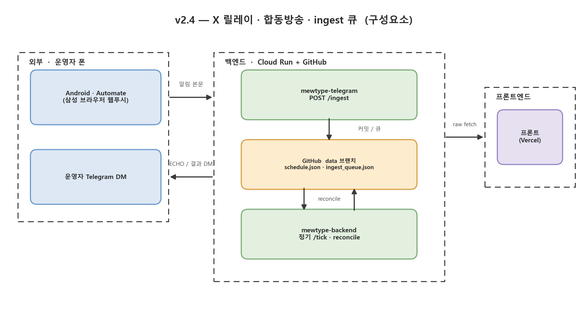

# 현행 아키텍처 — 전체 흐름

현재 배포돼 있는 시스템의 구성요소와 데이터 흐름. 그림의 각 박스를 그대로 설명한다.



*(생성기 `docs/plan/gen_v2_4.py` — `python docs/plan/gen_v2_4.py`)*

- 인터페이스 계약·모듈 명세: `docs/SPEC.md`
- 스케줄 타이밍(운영자 시점): `docs/SCHEDULE.md`
- 세부 설계: `docs/plan/v2_3_x_relay.md`(X 릴레이), `docs/plan/v2_4_collab.md`(합동방송),
  실배포 전환 런북 `docs/plan/v2_4_golive.md`

---

## 구성요소

### 외부 · 운영자 폰

- **Android · Automate** — 운영자가 `@BDP_yumemita` 를 팔로우. 삼성 브라우저 웹푸시 알림이 뜨면
  "HTTP Request" 블록이 `POST /ingest` (`X-Ingest-Secret` 헤더). 폰이 릴레이하는 건 **신호+본문**
  뿐이고, 판정·저장은 전부 백엔드가 한다.
  - Content body 식(이 폰 Automate 빌드 기준, 커밋 `1c21d9a`):
    `urlEncode({"text": coalesce(nx["android.bigText"], nx["android.text"], nmsg, nticker, "")})`
  - 이 빌드는 `urlEncode({"text": expr})` 의 값을 폼 **키** 자리로 흘린다 → 백엔드 `_ingest` 가
    폼 키에서 원문을 복구한다(`# ponytail:`). 상세: `docs/plan/v2_4_golive.md`.
  - `Expression true?` 필터: 본문에 `配信スケジュール` 또는 `出演情報` 포함 (백엔드
    `xrelay.looks_relayable` 과 동일). 테스트 기간엔 생략하고 전부 relay.
  - X **원글**(팔로우 계정 새 글) 알림은 `InboxStyle` 이라 트리거 시점 본문이 비는 경우가 있다.
    **리트윗·인용** 알림은 본문이 extra 에 실려 관통.
- **운영자 Telegram DM** — 아웃바운드 알림(A~F) 수신처. `/status /pause /resume /log` 명령 발신.

### 백엔드 · Cloud Run (`asia-northeast1`)

두 서비스가 **같은 컨테이너 이미지**를 공유하고 엔트리포인트만 다르다.

- **`mewtype-backend`** (비공개, `--no-allow-unauthenticated` + OIDC)
  - `POST /tick` — Cloud Scheduler 2잡(baseline JST 06:00 / light 3h)이 호출. RSS +
    `videos.list` 배치 1회 → `reconcile.build_schedule` 로 `schedule.json` 재구성 +
    `statemachine.sync_pending` 으로 `pending.json` 갱신 + 필요한 wake 태스크 enqueue.
  - `POST /wake {video_id}` — Cloud Tasks 가 방송별로 도달시킴. 그 방송 하나만 조회 →
    라이브 여부 확인 → 다음 체크 재예약(pre-live 3분 / live-watch 30분). 720h 상한 →
    `now+696h` 클램프 롱폴링.
  - `paused`(control.json) 면 `/tick`·`/wake` 는 healthcheck 핑만 하고 no-op.
  - 상태 전이(upcoming/live 시작·종료, fallback, 오류)를 Telegram DM 으로 직접 알림.
  - 성공 끝에 `HEALTHCHECK_URL`(healthchecks.io) GET 1발 → grace 초과 시 다운 알림.
- **`mewtype-telegram`** (공개, `--allow-unauthenticated`, `ALLOW_UNAUTH=1`)
  - `POST /telegram` — Telegram webhook. `X-Telegram-Bot-Api-Secret-Token` + `chat.id`
    허용목록. `/status`·`/pause`·`/resume`·`/log` 처리. `/resume` 은 메인 `/tick` 을 OIDC
    발급해 호출(heal).
  - `POST /ingest` — 폰 릴레이 인입 (X 예고 릴레이).
    - **테스트** (`INGEST_ECHO=1` 또는 `INGEST_DRY_RUN=1`): 파싱·저장 안 함. 받은 텍스트 DM 회신
      + `ingest ECHO: len=.. tail_ok=..` 로그. 스케줄/출연 트윗(`xrelay.looks_relayable`)만
      `ingest_queue.json` 에 원문 적재.
    - **실배포** (`INGEST_ECHO=0` · `INGEST_DRY_RUN=0`): `control.json` `paused` 확인 →
      `_ingest_queue_drain` 이 큐 원문을 `received_at` 순서로 `xrelay.parse` → `merge_scheduled`
      → `schedule.json` 커밋, 큐 비움. 이번 요청 본문도 파싱·머지.

### 저장 · GitHub `data` 브랜치

Cloud Run 이 GitHub Contents API(fine-grained PAT, Secret Manager)로 변경분만 커밋. 코드 없음.

| 파일 | 내용 |
|---|---|
| `schedule.json` | 계약 A. `status:"upcoming"/"live"` 실물 + `status:"scheduled"`(video_id 없음, X 릴레이 유래) + `host:"group"`(5인 공동명의 채널) |
| `archive.json` | 계약 B. 종료·취소·삭제된 방송 append-only |
| `pending.json` | 계약 E. wake 폴링 FSM 상태 (pre-live / live-watch) |
| `control.json` | 계약 F. `paused` / `log_level` |
| `ingest_queue.json` | 테스트 모드(ECHO/DRY-RUN) 중 온 스케줄 트윗 원문 버퍼. 실배포 전환 후 첫 `/ingest` 에서 drain |

### 프론트엔드 · Vercel

`schedule.json` 을 `raw.githubusercontent.com/.../data/schedule.json` 에서 75초마다 fetch.
빌드 없음, ES 모듈 직접 로드.

- `.card--live` / `.card--upcoming` — 실물 방송 카드.
- `.card--scheduled` — 예고(점선·감광), 썸네일 대신 `icon`, "예고" 배지, 링크는 채널 URL.
  `assumed_live` 면 `.card--sched-live`(실선·빨강기, "방송 중 (추정)").
- `.card--collab` — 합동(`kind=="collab"`). `render.js` 가 참여 멤버 전원(`channel_key` ∪
  `collab_with`) 레인에 같은 카드로 팬아웃. 링크는 `url`(그룹 영상). PC 5열 그리드·모바일
  캐러셀 레이아웃 무변경.

---

## 화살표 (데이터 이동)

| | |
|---|---|
| 알림 본문 | Automate → `mewtype-telegram` `POST /ingest` (`text=` form, 또는 폼 키로) |
| ECHO / 결과 / 알림 DM | Telegram `sendMessage` (양 서비스 → 운영자) |
| 정기 트리거 | Cloud Scheduler → `mewtype-backend` `POST /tick` (OIDC) |
| 방송별 wake | Cloud Tasks → `mewtype-backend` `POST /wake` (OIDC) |
| heal | `mewtype-telegram` `/resume` → `mewtype-backend` `/tick` (OIDC) |
| 커밋 / 큐 | Cloud Run → GitHub Contents API (`schedule.json` 등 커밋 / `ingest_queue.json` 적재·drain) |
| reconcile | 정기 `/tick` 이 `data` 브랜치 읽기·쓰기 |
| raw fetch | `raw.githubusercontent.com/.../data/schedule.json` (프론트 75초 폴링) |
| 다운 감지 | `mewtype-backend` `/tick` 성공 → healthchecks.io GET → (grace 초과) Telegram |

---

## `scheduled` 행의 일생 (X 릴레이 유래)

```
@BDP_yumemita 일일 스케줄/出演情報 트윗
        │  폰 Automate → POST /ingest
        ▼
xrelay.parse → merge_scheduled → schedule.json 에 status:"scheduled" 행 (video_id 없음)
        │
        ├─ 정기 /tick 의 reconcile 이 매번 보존
        ├─ 같은 채널 실물 upcoming/live 가 ±4h 안에 뜸 → supersede(제거)
        ├─ scheduled_start 경과 → assumed_live=true (회원전용은 API 로 실물 못 봄)
        ├─ host:"group" 행은 멤버 개인 실물로 supersede 안 함 (그룹 채널은 추적 5채널 아님)
        └─ expires_at (start + 공개 3h / 회원전용 5h) 도달 → 제거
```

Cloud Tasks/`pending.json` 은 안 탄다. 대신 `handlers._scheduled_wake_times` 가
`scheduled_start`(지금~+3h)마다 `light /tick` 1개를 예약해 공개 방송의 정시 시작을 RSS 로 줍는다.
