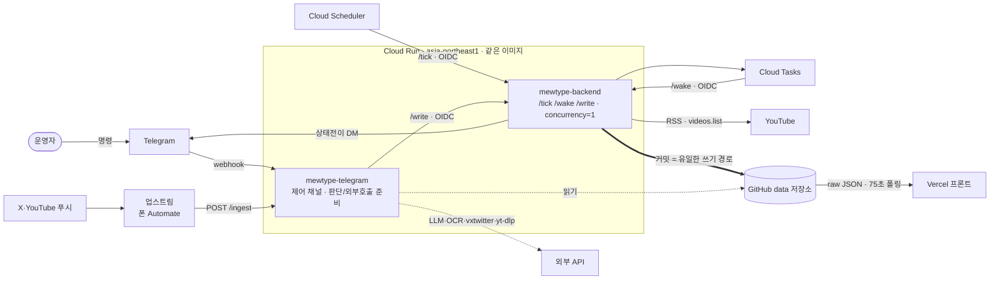

# 현행 아키텍처 — 전체 흐름 (v3)

현재 배포돼 있는 시스템(v3.x)의 구성요소와 데이터 흐름.

> 🔜 **v3.8.2(미배포) 판**: `data` 저장소 접근을 DB 관제소(`mewtype-db-tower`) 하나로 모으는 변경 — [`ARCHITECTURE_v3.8.2.md`](ARCHITECTURE_v3.8.2.md) · [`v3_pamphlet_v3.8.2.html`](v3_pamphlet_v3.8.2.html). 배포되면 이 문서를 그 내용으로 교체한다.

> **인터랙티브 도식은 [`v3_pamphlet.html`](v3_pamphlet.html)** — 시나리오별로 신호가 어디를 거치는지 애니메이션으로 본다.
> 이 문서는 그 텍스트 설명이다. 구조가 바뀌면 **팜플렛과 이 문서를 같이 갱신**한다.
> (v2.4 시절 PNG `v2_4_flow.png` 는 v3 구조와 달라 더는 쓰지 않는다.)

- 인터페이스 계약·모듈 명세: `docs/SPEC.md` (main 브랜치) — 특히 §8.14 write-queue
- 인입(`/ingest`) 전체 흐름·서비스별 실행 위치: `docs/INGEST_FLOW.md` (main 브랜치)
- 버전별 변경: `docs/VERSION.md` (main 브랜치)
- 스케줄 타이밍(운영자 시점): `docs/SCHEDULE.md`



---

## 핵심 원칙: 쓰기 경로는 하나 (v3.7 · v3.7.1)

GitHub Contents API 의 PUT 은 파일이 아니라 **브랜치 HEAD 단위**로 충돌한다(다른 파일이어도 읽은 뒤 다른 커밋이 끼면 409).
그래서 `data` 저장소에 대한 **콘텐츠 커밋은 전부 백엔드 `POST /write`**(`--concurrency=1 --max-instances=1`)로 모아 한 줄로 세운다.

- **제어 채널(`mewtype-telegram`, 동시 처리 80)** — 읽기는 GitHub 를 직접 하고, 외부 호출(외부 LLM·`videos.list`·vxtwitter·비전 OCR·yt-dlp)과 판단을 **먼저 준비**한 뒤 결과를 JSON 인자로 `/write` 에 넘긴다(OIDC, `writeclient.call_write`, 타임아웃 60초, 2초 넘으면 "처리 대기 중" DM).
- **백엔드 `/write` 잡** — GitHub 읽기·쓰기(+ undo 스냅샷, 모니터 로그, DM, Cloud Tasks enqueue)만 한다. 외부 장애가 `/tick`·`/wake` 를 같이 막지 않게 하려는 분리(A-1).
  등록 kind: `merge_rows` `remove_broadcast` `apply_notice` `notice_sweep` `notice_del_commit` `notice_edit_commit` `personal_tweet` `tweet_sweep` `tweet_del_commit` `url_confirmed_commit` `yt_member_live_commit`(v3.7.3) `undo_restore` `apply_preview_edit` `ingest_queue_push` `ingest_queue_drain`.
- **큐를 우회하는 예외(409 가능, 잡은 최신 재조회 후 1회 재시도)** — `control.json`(/pause·/resume), `admin_state.json` 마법사 슬롯, 모니터 로그(notice/relay/ops), `/translate`, `/monitor` 의 `latest.html`.
- `/tick`·`/wake` 도 백엔드 안에서 같은 GitHub 커밋을 하며 서로·`/write` 와는 `ConflictError` + 1회 재계산으로 충돌을 처리한다.

---

## 구성요소

### 외부 · 운영자 폰

- **Android · Automate (업스트림)** — 운영자 폰이 X·YouTube 푸시 알림을 받아 `POST /ingest` (`X-Ingest-Secret`)로 중계. 폰은 **신호+본문만** 릴레이하고 판정·저장은 전부 백엔드가 한다. 코드베이스 밖.
  - X 알림: form `text`(본문) + `title`(`android.title`, 게시자 표시 이름) + `template` + `tag`(트윗 태그).
    `template` 이 `BigTextStyle` 이 아니면(다운로드·그룹요약·미디어재생) 폰 게이트가 차단.
  - **(v3.7.3) YouTube 알림**: 폼 `source=yt&video_id&title&kind&tag`. 유튜브 앱의 "회원 전용 실시간 스트림" 알림이 대상.
  - 이 폰 빌드는 `urlEncode({"text": expr})` 의 값을 폼 **키** 자리로 흘려, 백엔드 `_ingest` 가 폼 키에서 원문을 복구한다.
  - 업스트림 배선 상세: `docs/plan/` 의 Automate 배선도.
- **운영자 Telegram DM** — 아웃바운드 알림 수신처이자 명령(`/status /list /pause /resume /ingest /edit /del /undo /notice …`) 발신처.

### 백엔드 · Cloud Run (`asia-northeast1`)

두 서비스가 **같은 컨테이너 이미지**를 공유하고 엔트리포인트만 다르다. **`writers.py` 등 공통 코드를 바꾸면 두 서비스 모두 재배포.**

- **`mewtype-backend`** (비공개, `--no-allow-unauthenticated` + OIDC, `--concurrency=1 --max-instances=1`)
  - `POST /tick` — Cloud Scheduler 가 호출(baseline JST 06:00 / light 10분, v3.6). RSS + `videos.list` 배치 1회 →
    `preview_build.build_preview` 로 `preview.json` 재구성(6상태, FSM 파생) + 필요한 wake 태스크 enqueue + LLM 번역 sweep.
    `xtweet.apply_overrides` 로 개인 트윗이 정한 시각을 API 재구성이 안 덮게 한다.
  - `POST /wake {video_id}` — Cloud Tasks 가 방송별로 도달시킴. 그 방송 하나만 조회 → 상태 전이 → 다음 체크 재예약
    (pre-live 3분 / 시작~+60분 10분 · 이후 5분, `LIVE_TIGHT_SEC=300`). 시작이 24시간 넘게 남은 방송은 wake 미등록(v3.7.3),
    주기 격자에 맞춘 같은 이름으로 dedupe 해 체인 증식 방지.
  - `POST /write {kind, args}` — 제어 채널의 콘텐츠 커밋 잡(위 "쓰기 경로는 하나").
  - `POST /monitor` — Cloud Scheduler KST 06:10, Ops 리포트(`monitoring/latest.html`) 커밋 + DM.
  - `paused`(control.json) 면 `/tick`·`/wake` 는 healthcheck 핑만 하고 no-op.
  - 상태 전이(upcoming/live 시작·종료 등)를 Telegram DM 으로 직접 알림. 성공 끝에 `HEALTHCHECK_URL`(healthchecks.io) GET 1발.
  - 모니터 로그는 실행당 커밋 최대 1개, 변화 없는 tick/wake 는 기록 안 함.
- **`mewtype-telegram`** (공개, `--allow-unauthenticated`, `ALLOW_UNAUTH=1`) — 제어 채널
  - `POST /telegram` — Telegram webhook. `X-Telegram-Bot-Api-Secret-Token` + `chat.id` 허용목록. 명령 처리.
    `/resume` 은 메인 `/tick` 을 OIDC 로 호출(heal). `/ingest`·`/notice`·`/undo` 는 2단계(슬롯 TTL) 마법사.
    값을 바꾸는 명령의 커밋은 `/write`(`remove_broadcast`·`apply_preview_edit`·`undo_restore`·`apply_notice` …).
  - `POST /ingest` — 업스트림 인입.
    - **분기 순서**: `source=yt` 면 YouTube 알림 경로 → 아니면 `android.title` 라우팅(`xtweet.route_by_title`).
    - **개인 5인 표시명** → `_maybe_personal_tweet`(준비: vxtwitter 미디어·파싱·번역 LLM → `/write personal_tweet` → DM) → 예고 형식이면 `_maybe_personal_schedule`
      (유튜브 URL 이면 `videos.list` 사실 확정 → `url_confirmed_commit`, 텍스트면 정규식 후보 + 최종 LLM 확인 → `merge_rows`). 소식/스케줄 파이프라인은 안 탐.
    - **테스트 부계정**(`INGEST_TEST_TITLES`, 기본 `jehy`) → `force_echo` (헬스체크, 저장 안 함).
    - **공식·미매칭** → 스케줄(`xrelay`, BDP_yumemita 일일 스케줄 → `announced`) 또는 소식(`_maybe_auto_notice` → `xnotice.parse` → 의미 중복 게이트 LLM → `apply_notice`).
    - **(v3.7.3) `source=yt`** — `kind` 가 회원 전용 라이브 시작이고 제목 앞부분이 5인 채널명일 때만 처리(그 외 무시, 항상 200).
      알림 `video_id` 가 `default` 라 `ytdlp_probe`(yt-dlp, 상한 6초)로 channel streams 탭에서 회원 전용 라이브를 찾아 `/write yt_member_live_commit` 으로 live 승격.
    - 원본 바디는 `request.form` 접근 전에 `get_data(cache=True, parse_form_data=False)` 로 캐시(Werkzeug 스트림 소비 버그).
    - 테스트 모드(`INGEST_ECHO=1`/`INGEST_DRY_RUN=1`): 파싱·저장 안 하고 회신, 스케줄 트윗은 `ingest_queue.json` 적재 → 실배포 전환 후 첫 `/ingest` 에서 drain.
    - 상세 흐름: `docs/INGEST_FLOW.md`, 판정 트리: `v3_pamphlet.html`.
  - `GET /monitor-live` (v3.7.2) — 웹 `monitor.html` 이 부르는 읽기 전용 공개 라우트, 접속 시각 기준(가장 최근 06:00 KST~지금) 리포트 즉석 생성(60초 캐시).

### 저장 · GitHub `data` 저장소

2026-09-14 부터 코드 저장소와 분리된 별도 저장소(`mewtype-scheduler-data`, Vercel 비연결). Cloud Run 이 GitHub Contents API(fine-grained PAT, Secret Manager)로 변경분만 커밋. 코드 없음.
(v2 의 `schedule.json` / `archive.json` / `pending.json` 은 폐지 — v3 는 아래로 대체.)

| 파일 | 내용 |
|---|---|
| `preview.json` | 계약 A. 6상태(`announced → upcoming → watching → live ↔ end → none`) 아이템. 예고(announced)·실물·합동(`kind=="collab"`)·회원 전용(`membership`) 모두 여기 |
| `preview_archive.json` | 계약 B. 종료·삭제된 방송 append-only |
| `control.json` | 계약 F. `paused` / `log_level` |
| `admin_state.json` | 계약 G. 텔레그램 명령 슬롯(`pending_*`·`edit_lock`·`suppress`·`undo`) |
| `notices.json` · `notice_archive.json` | 계약 H. 방송 외 소식. 중복제거·병합·`expires_at` sweep, 만료분은 archive |
| `tweets.json` · `tweet_archive.json` | 계약 I. 개인 5인 트윗 스레드(메시지별 `expires_at`=+24h, 상한 50건 표시). 만료·교체분은 archive |
| `ingest_queue.json` | 테스트 모드 중 온 스케줄 트윗 원문 버퍼 |
| `monitoring/events-YYYY-MM-DD.jsonl` · `latest.html` | 파이프라인 이벤트 로그 · `/monitor` 리포트 |

### 프론트엔드 · Vercel

`preview.json`(예고판) · `notices.json`(티커) · `tweets.json`(배지)을 `raw.githubusercontent.com/.../data/` 에서 **75초**마다 fetch. 빌드 없음, ES 모듈 직접 로드.
모바일 백그라운드 복귀(`visibilitychange`/`pageshow`) 시 즉시 재폴링.

- 레인 = 유닛 1명(PC 5열 · 모바일 1인 1화면 캐러셀). 카드 클래스는 상태별(announced 점선·감광 / upcoming·watching 썸네일 / live 빨강 / collab 보라 — 참여 멤버 전원 레인에 팬아웃).
- `js/notices.js` — 상단 `#notice` 티커(5초 회전, 당일 소식은 빨간 램프, 만료분은 프론트에서도 숨김).
- `js/tweets.js` — 유닛 아바타 편지 배지. **(v3.8)** 트윗 하나 = **번역 말풍선(`text_ko`) + X 공식 카드(iframe)** 2열.
  원문·이미지·영상을 우리가 다시 조립해 그리지 않는다(2026-09-19 법률 자문). 카드는 화면에 들어올 때만 로드, 번역 ON/OFF 토글은 카드 재로드 없이 CSS 로.
  24시간·최대 50건, 읽음 상태는 뷰어별 `localStorage`. 하단 디스클레이머(비공식 팬 번역·비영리·삭제 요청 창구).
- `monitor.html` — 웹 모니터(제어 채널 `/monitor-live`, 실패 시 `latest.html` 폴백).

---

## 화살표 (데이터 이동)

| | |
|---|---|
| 알림 본문 | Automate → `mewtype-telegram` `POST /ingest` — X: form `text`+`title`+`template`+`tag` / YouTube: `source=yt&video_id&title&kind&tag` |
| 운영 명령 · webhook | 운영자 → Telegram → `mewtype-telegram` `POST /telegram` |
| ECHO / 결과 / 알림 DM | Telegram `sendMessage` (양 서비스 → 운영자) |
| 정기 트리거 | Cloud Scheduler → `mewtype-backend` `POST /tick` · `POST /monitor` (OIDC) |
| 방송별 wake | Cloud Tasks → `mewtype-backend` `POST /wake` (OIDC) · 백엔드가 다음 wake 를 Cloud Tasks 에 enqueue |
| **콘텐츠 쓰기** | `mewtype-telegram` → `mewtype-backend` `POST /write` (OIDC) → GitHub Contents API 커밋 |
| 읽기 | `mewtype-telegram` → GitHub Contents API 직접(`/status` `/list` 등) |
| tick/wake 커밋 | `mewtype-backend` → GitHub Contents API (`preview.json` 등, 충돌 시 재계산 1회) |
| heal | `mewtype-telegram` `/resume` → `mewtype-backend` `/tick` (OIDC) |
| 외부 호출 | 제어 채널 → 외부 LLM(Groq)·vxtwitter/fxtwitter·yt-dlp·비전 OCR / 백엔드 → YouTube RSS·`videos.list` |
| raw fetch | `raw.githubusercontent.com/.../data/{preview,notices,tweets}.json` (프론트 75초 폴링) |
| 다운 감지 | `mewtype-backend` `/tick` 성공 → healthchecks.io GET → (grace 초과) Telegram |

---

## `announced` 행의 일생 (예고 · X 릴레이/개인 트윗 유래)

```
@BDP_yumemita 일일 스케줄 / 개인 트윗 예고 / /ingest 수동
        │  폰 Automate → POST /ingest  (→ 제어 채널 준비 → 백엔드 /write merge_rows)
        ▼
preview.json 에 status "announced" 행 (video_id 없음, 링크는 채널)
        │
        ├─ 정기 /tick 의 build_preview 가 매번 보존
        ├─ 같은 채널 실물(upcoming/live)이 근처에 뜸 → 실물이 대체
        ├─ 예정 시각 경과 → assumed_live (회원 전용은 API 로 실물 못 봄)
        │     ├─ 120분 넘게 조용 → announced 로 late-hold (watching 왕복 금지, v3.7.3)
        │     └─ 회원 전용 라이브 알림(source=yt) 도착 → live 로 직접 승격 (v3.7.3)
        └─ expires_at 도달 → 제거
```

`watching` 진입(시작 3분 전)부터는 Cloud Tasks wake 가 정밀 폴링한다. `announced` 는 wake 를 안 타고,
정기 light `/tick`(10분)과 `_scheduled_wake_times` 가 예정 시각 근처를 줍는다.
