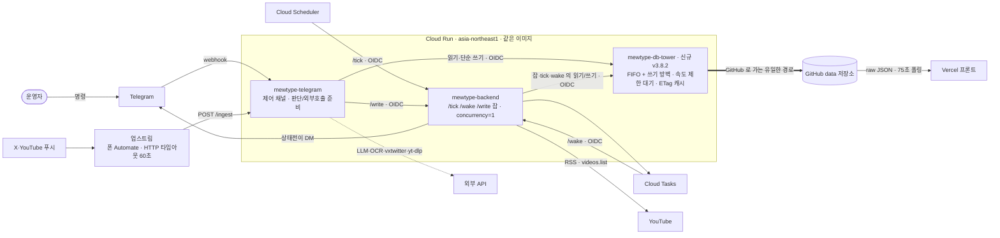

# 아키텍처 — 전체 흐름 (v3.8.2 · 미배포)

> ⛔ **보류 (2026-09-21 사용자 결정) — 배포·머지 금지.** 사유·실험 결과·재검토 조건: [`plan/HOLD_v3.8.2_db_control_tower.md`](plan/HOLD_v3.8.2_db_control_tower.md).
> 또한 아래 "현재 배포본(v3.8.1)" 서술은 작성 시점 기준이며, 실제 현재 배포본은 **v3.8.3**(본인 채널 합동방송 감지, 2026-09-21)이다 — 이 문서의 표는 v3.8.3 이전 기준으로 읽을 것.

> ⚠️ **이 문서는 v3.8.2(미배포) 기준입니다.** 현재 배포된 시스템(v3.8.1)은 [`ARCHITECTURE.md`](ARCHITECTURE.md) 가 설명합니다.
> v3.8.2 는 `data` 저장소 접근을 **DB 관제소**(신규 서비스 `mewtype-db-tower`) 하나로 모으는 변경이며, 코드는 브랜치
> `v3.8.2-db-control-tower`(main 미병합)에 있습니다. **배포가 끝나면 이 내용으로 `ARCHITECTURE.md` 를 교체**하고 이 파일은 지웁니다.
> 인터랙티브 도식: [`v3_pamphlet_v3.8.2.html`](v3_pamphlet_v3.8.2.html).

- 인터페이스 계약·모듈 명세: `docs/SPEC.md` (main, 브랜치 `v3.8.2-db-control-tower` 의 §8.15 가 관제소)
- 인입(`/ingest`) 전체 흐름: `docs/INGEST_FLOW.md` (main)
- 버전별 변경: `docs/VERSION.md` (main, v3.8.2 항목이 관제소)
- 스케줄 타이밍(운영자 시점): `docs/SCHEDULE.md`

## 현재 배포본(v3.8.1)과 달라지는 점

| 항목 | v3.8.1 (배포됨) | v3.8.2 (미배포) |
|---|---|---|
| Cloud Run 서비스 | 2개 (`mewtype-backend`, `mewtype-telegram`) | **3개** (+ `mewtype-db-tower`) |
| `data` 저장소 읽기 | 제어 채널이 GitHub 를 직접 | **전부 관제소 `/fetch`** |
| `data` 저장소 쓰기 | `/write` 잡(백엔드)만 큐, 나머지(`control.json`·`admin_state.json`·모니터 로그 등)는 제어 채널이 직접 | **전부 관제소 `/put`** (콘텐츠 잡은 여전히 백엔드 `/write`) |
| 백엔드 `/tick`·`/wake` 의 GitHub 접근 | 직접 | **관제소 경유** |
| 속도 제한(403/429) | 대응 없음 — 한 번 걸리면 그 명령 실패 | 관제소가 `retry-after` 만큼 큐 전체를 멈추고 기다렸다 재시도 |
| 읽기 캐시 | 없음 | 관제소 ETag 캐시 (304 는 한도에 안 세어짐) |



---

## 핵심 원칙: `data` 저장소 접근은 관제소 하나 (v3.8.2 · 미배포)

**왜 필요한가** — 실제 GitHub 에 대해 확인한 사실(2026-09-21, 임시 브랜치, `scripts/probe_github.py`):
같은 브랜치에 **동시에 PUT 하면 하나만 성공하고 나머지는 409** 다(3개→1성공, 5개→1성공, 8개→1성공. 서로 다른 파일이어도 마찬가지, 실패 응답도 1.4~1.9초).
v3.7 은 콘텐츠 커밋 일부를 백엔드 `/write`(concurrency=1)로 모아 이 문제를 줄였지만, 제어 채널의 나머지 GitHub 접근(모든 읽기·`control.json`·`admin_state.json`·모니터 로그 등)은 여전히 각자 GitHub 를 직접 두드렸다.
GitHub 문서도 secondary rate limit 을 피하려면 요청을 직렬로 보내고 큐를 두라고 한다(쓰기가 많으면 ≥1초 간격, `retry-after` 준수, 조건부 요청 304 는 primary 한도 미집계).

**어떻게 하는가** — 제어 채널과 백엔드 모두 `data` 저장소를 직접 부르지 않고 `mewtype-db-tower` 로 보낸다(`towerclient.TowerStore`, `TOWER_URL` 이 없으면 종전처럼 직접 — 로컬·미배포 대비).

- **FIFO + 쓰기 방벽** — 도착 순서를 지킨다. 읽기끼리는 함께(동시 최대 6) 통과하고, 쓰기는 앞선 읽기가 모두 끝나야 진입해 단독으로 실행된다. 쓰기 뒤에 온 읽기는 쓰기를 앞지르지 못한다 → 읽기 도중 값이 바뀌지 않고 결과가 도착 순서를 반영.
- **쓰기 간격** — 쓰기 사이 최소 0.3초(`TOWER_WRITE_GAP_SEC`). GitHub 문서 권고(≥1초)는 쓰기가 많을 때 기준이라 짧은 버스트의 지연 비용을 보고 낮춤(시뮬레이션: 1.0초는 버스트 8 최대 33.4초, 0.3초는 27.7초).
- **속도 제한 대기** — 403/429 를 만나면 `retry-after` 만큼 큐 전체를 멈춘다(없으면 1분부터 지수). 재시도 3회 초과·대기 상한 초과 시 503 + `Retry-After` 로 돌려준다(호출자 타임아웃 안에서 실패가 정리됨).
- **읽기 ETag 캐시** — 안 바뀐 파일은 조건부 요청(304). 실측: 304 는 `x-ratelimit-used` 를 올리지 않는다.
- **오류 매핑** — sha 충돌 409(호출자가 재계산), 대기 상한/속도 제한 지속 503(`TowerBusyError`), 잘못된 입력 400, 인증 실패 403, 그 외 GitHub 오류 502.
- **트랜잭션은 그대로 백엔드** — 관제소는 **개별 GitHub 호출**의 순서·속도만 다룬다. 읽기→병합→쓰기 한 덩어리의 직렬화는 여전히 백엔드 `/write` 잡(`--concurrency=1`)이 맡는다. 잡 안의 GitHub 호출이 관제소를 거친다.
  잡 밖의 단순 쓰기가 잡의 읽기~쓰기 사이에 끼면 같은 파일일 때 `prev_sha` 검사로 `ConflictError`(전과 같은 종류의 경합).
- **상태는 메모리** — 큐·쿨다운·ETag 캐시는 프로세스 메모리. 서비스가 꺼지면 사라지지만, 다시 켜진 뒤 첫 요청이 429 를 받으면 `retry-after` 를 새로 배운다(정확성 영향 없음).

### 배포 형태 (`deploy/deploy_tower.sh`)

- `--concurrency=64 --max-instances=1 --min-instances=0 --timeout=90`, gunicorn `--workers=1 --threads=64`. 백엔드(`--concurrency=1`)와 다르다 — 관제소는 요청이 프로세스 안에서 줄을 서야 대기 상한(503)을 통제할 수 있어 여러 요청이 동시에 들어와 있어야 하고, 순서·방벽이 서비스 전체에서 성립하도록 인스턴스는 하나.
- **상시 ON 아님**(scale-to-zero). cold start 는 같은 이미지 서비스 기록(7일)으로 평균 ≈0.5초, p95 ≈1초.
- 인증 OIDC(`--no-allow-unauthenticated`), 호출자 두 서비스계정을 `CALLER_SAS`(쉼표 목록)로 허용 — 백엔드 `mewtype-backend`, 제어 채널 `mewtype-invoker`. 실제 Google 서명 토큰으로 검증 완료.
- 조정 값(환경변수, 재배포 없이 변경 가능): `TOWER_WRITE_GAP_SEC`(기본 0.3), `TOWER_MAX_READERS`(기본 6).
- **배포 순서: 관제소 → 백엔드 → 제어 채널.** 관제소가 없으면 두 서비스는 `TOWER_URL` 없이 종전처럼 직접 접근하므로 순서를 지키면 무중단.

### 남는 직접 GitHub 호출 · 한계

- `data` 저장소가 아닌 **코드 저장소** 커밋 수 조회(`/monitor`·`/monitor-live` → `push_monitor.fetch_commits`, `api.github.com/.../commits`)는 관제소를 거치지 않는다. 제어 채널이 `GITHUB_TOKEN` 을 아직 들고 있는 이유.
- 관제소 장애 시 제어 채널의 읽기 명령(`/status`·`/list`)과 `/tick`·`/wake` 의 GitHub 접근이 함께 멈춘다. 모든 접근에 홉이 하나 붙는다(수십~수백 ms).
- **버스트 지연은 관제소와 무관한 기존 한계**다: `/ingest` 는 트윗당 최소 2번의 직렬 쓰기(실측 PUT ≈0.8초씩)라 버스트 5 부터 10초를 넘는 요청이 생긴다(시뮬레이션 버스트 12 최대 ≈41초, 관제소 오버헤드는 2~3%). 그래서 **업스트림 Automate 의 HTTP 타임아웃을 60초로 올렸다**(2026-09-21, 타임아웃 시 재시도 없음).

---

## 구성요소

### 외부 · 운영자 폰

- **Android · Automate (업스트림)** — 운영자 폰이 X·YouTube 푸시 알림을 받아 `POST /ingest` (`X-Ingest-Secret`). 폰은 **신호+본문만** 릴레이하고 판정·저장은 전부 백엔드가 한다. 코드베이스 밖. **HTTP 요청 타임아웃 60초**(2026-09-21 상향; 타임아웃이 나면 재시도하지 않으므로 버스트에서도 응답을 기다릴 수 있어야 함).
  - X 알림: form `text`(본문) + `title`(`android.title`, 게시자 표시 이름) + `template` + `tag`(트윗 태그). `template` 이 `BigTextStyle` 이 아니면(다운로드·그룹요약·미디어재생) 폰 게이트가 차단.
  - **(v3.7.3) YouTube 알림**: 폼 `source=yt&video_id&title&kind&tag`. 유튜브 앱의 "회원 전용 실시간 스트림" 알림이 대상.
  - 이 폰 빌드는 `urlEncode({"text": expr})` 의 값을 폼 **키** 자리로 흘려, 백엔드 `_ingest` 가 폼 키에서 원문을 복구한다.
  - 업스트림 배선 상세: `docs/plan/` 의 Automate 배선도.
- **운영자 Telegram DM** — 아웃바운드 알림 수신처이자 명령(`/status /list /pause /resume /ingest /edit /del /undo /notice …`) 발신처.

### DB 관제소 · Cloud Run (`asia-northeast1`) — 신규 (v3.8.2 · 미배포)

**`mewtype-db-tower`** (비공개, `--no-allow-unauthenticated` + OIDC, 같은 컨테이너 이미지·엔트리포인트 `src.backend.tower_app:app`)

- `POST /fetch {"path","as":"json"|"text","budget"?}` → `{"found","data"|"text","sha"}` (없으면 `found:false`, 200).
- `POST /put {"path","as":"json"|"text","data"|"text","prev_sha"?,"message","budget"?}` → `{"changed","sha"}` (내용이 같으면 PUT 생략, `prev_sha` 불일치 → 409).
- `GET /` — 헬스 + 대기열 상태 `{"ok","depth","cooldown_sec"}`.
- `path` 는 data 저장소 상대경로만(빈 값·절대경로·`..`·역슬래시·200자 초과 거부). `budget` 은 호출자가 기다릴 수 있는 시간(클라이언트 타임아웃 60초 − 8초, 서비스 상한 85초).
- 핵심 로직 `tower.Tower`: `_RwGate`(FIFO + 쓰기 방벽) · 쓰기 간격 · 속도 제한 대기 · 읽기 ETag 캐시. 자세히는 위 "핵심 원칙".

### 백엔드 · Cloud Run (`asia-northeast1`)

두 서비스(백엔드·제어 채널)가 **같은 컨테이너 이미지**를 공유하고 엔트리포인트만 다르다. **`writers.py` 등 공통 코드를 바꾸면 두 서비스 모두 재배포.**

- **`mewtype-backend`** (비공개, `--no-allow-unauthenticated` + OIDC, `--concurrency=1 --max-instances=1`)
  - `POST /tick` — Cloud Scheduler 가 호출(baseline JST 06:00 / light 10분). RSS + `videos.list` 배치 1회 → `preview_build.build_preview` 로 `preview.json` 재구성(6상태, FSM 파생) + 필요한 wake 태스크 enqueue + LLM 번역 sweep.
    `xtweet.apply_overrides` 로 개인 트윗이 정한 시각을 API 재구성이 안 덮게 한다. **GitHub 접근은 관제소 경유(v3.8.2).**
  - `POST /wake {video_id}` — Cloud Tasks 가 방송별로 도달시킴. 그 방송 하나만 조회 → 상태 전이 → 다음 체크 재예약(pre-live 3분 / 시작~+60분 10분 · 이후 5분). 시작이 24시간 넘게 남은 방송은 wake 미등록, 주기 격자에 맞춘 같은 이름으로 dedupe.
  - `POST /write {kind, args}` — 제어 채널의 콘텐츠 커밋 잡(트랜잭션 직렬화). 등록 kind: `merge_rows` `remove_broadcast` `apply_notice` `notice_sweep` `notice_del_commit` `notice_edit_commit` `personal_tweet` `tweet_sweep` `tweet_del_commit` `url_confirmed_commit` `yt_member_live_commit` `undo_restore` `apply_preview_edit` `ingest_queue_push` `ingest_queue_drain`. **잡 안의 GitHub 접근은 관제소 경유.**
  - `POST /monitor` — Cloud Scheduler KST 06:10, Ops 리포트(`monitoring/latest.html`) 커밋 + DM.
  - `paused`(control.json) 면 `/tick`·`/wake` 는 healthcheck 핑만 하고 no-op. 상태 전이를 Telegram DM 으로 직접 알림. 성공 끝에 `HEALTHCHECK_URL` GET 1발.
- **`mewtype-telegram`** (공개, `--allow-unauthenticated`, `ALLOW_UNAUTH=1`) — 제어 채널 (인스턴스 최대 20, 동시성 80)
  - `POST /telegram` — Telegram webhook. `X-Telegram-Bot-Api-Secret-Token` + `chat.id` 허용목록. 명령 처리. `/resume` 은 메인 `/tick` 을 OIDC 로 호출(heal). `/ingest`·`/notice`·`/undo` 는 2단계(슬롯 TTL) 마법사.
    값을 바꾸는 콘텐츠 커밋은 백엔드 `/write`, 그 외 읽기·단순 쓰기(`control.json`·`admin_state.json`·모니터 로그·`/translate` 등)는 **관제소** 로 (v3.8.2).
  - `POST /ingest` — 업스트림 인입.
    - **분기 순서**: `source=yt` 면 YouTube 알림 경로 → 아니면 `android.title` 라우팅(`xtweet.route_by_title`).
    - **개인 5인 표시명** → `_maybe_personal_tweet`(준비: vxtwitter 미디어·파싱·번역 LLM → `/write personal_tweet` → DM) → 예고 형식이면 `_maybe_personal_schedule`(유튜브 URL 이면 `videos.list` 사실 확정 → `url_confirmed_commit`, 텍스트면 정규식 후보 + 최종 LLM 확인 → `merge_rows`).
    - **테스트 부계정**(`INGEST_TEST_TITLES`, 기본 `jehy`) → `force_echo` (헬스체크, 저장 안 함).
    - **공식·미매칭** → 스케줄(`xrelay`, BDP_yumemita 일일 스케줄 → `announced`) 또는 소식(`_maybe_auto_notice` → `xnotice.parse` → 의미 중복 게이트 LLM → `apply_notice`).
    - **(v3.7.3) `source=yt`** — `kind` 가 회원 전용 라이브 시작이고 제목 앞부분이 5인 채널명일 때만 처리(그 외 무시, 항상 200). 알림 `video_id` 가 `default` 라 `ytdlp_probe`(yt-dlp, 상한 6초)로 streams 탭에서 회원 전용 라이브를 찾아 `/write yt_member_live_commit` 으로 live 승격.
    - 원본 바디는 `request.form` 접근 전에 `get_data(cache=True, parse_form_data=False)` 로 캐시(Werkzeug 스트림 소비 버그).
    - 테스트 모드(`INGEST_ECHO=1`/`INGEST_DRY_RUN=1`): 파싱·저장 안 하고 회신, 스케줄 트윗은 `ingest_queue.json` 적재 → 실배포 전환 후 첫 `/ingest` 에서 drain.
  - `GET /monitor-live` (v3.7.2) — 웹 `monitor.html` 이 부르는 읽기 전용 공개 라우트, 접속 시각 기준(가장 최근 06:00 KST~지금) 리포트 즉석 생성(60초 캐시).

### 저장 · GitHub `data` 저장소

2026-09-14 부터 코드 저장소와 분리된 별도 저장소(`mewtype-scheduler-data`, Vercel 비연결). **GitHub Contents API(fine-grained PAT, Secret Manager)로 변경분만 커밋하며, 그 호출은 v3.8.2 부터 관제소만 한다.** 코드 없음.

| 파일 | 내용 |
|---|---|
| `preview.json` | 계약 A. 6상태(`announced → upcoming → watching → live ↔ end → none`) 아이템. 예고·실물·합동(`kind=="collab"`)·회원 전용(`membership`) 모두 여기 |
| `preview_archive.json` | 계약 B. 종료·삭제된 방송 append-only |
| `control.json` | 계약 F. `paused` / `log_level` |
| `admin_state.json` | 계약 G. 텔레그램 명령 슬롯(`pending_*`·`edit_lock`·`suppress`·`undo`) |
| `notices.json` · `notice_archive.json` | 계약 H. 방송 외 소식. 중복제거·병합·`expires_at` sweep, 만료분은 archive |
| `tweets.json` · `tweet_archive.json` | 계약 I. 개인 5인 트윗 스레드(메시지별 `expires_at`=+24h, 상한 50건 표시). 만료·교체분은 archive |
| `ingest_queue.json` | 테스트 모드 중 온 스케줄 트윗 원문 버퍼 |
| `monitoring/events-YYYY-MM-DD.jsonl` · `latest.html` | 파이프라인 이벤트 로그 · `/monitor` 리포트 |

### 프론트엔드 · Vercel

`preview.json`(예고판) · `notices.json`(티커) · `tweets.json`(배지)을 `raw.githubusercontent.com/.../data/` 에서 **75초**마다 fetch (관제소를 거치지 않는 직접 읽기). 빌드 없음, ES 모듈 직접 로드. 모바일 백그라운드 복귀(`visibilitychange`/`pageshow`) 시 즉시 재폴링.

- 레인 = 유닛 1명(PC 5열 · 모바일 1인 1화면 캐러셀). 카드 클래스는 상태별(announced 점선·감광 / upcoming·watching 썸네일 / live 빨강 / collab 보라 — 참여 멤버 전원 레인에 팬아웃).
- `js/notices.js` — 상단 `#notice` 티커(5초 회전, 당일 소식은 빨간 램프, 만료분은 프론트에서도 숨김).
- `js/tweets.js` — 유닛 아바타 편지 배지. **(v3.8)** 트윗 하나 = **번역 말풍선(`text_ko`) + X 공식 카드(iframe)** 2열. 원문·이미지·영상을 우리가 다시 조립해 그리지 않는다(2026-09-19 법률 자문). 카드는 화면에 들어올 때만 로드, 번역 ON/OFF 토글은 카드 재로드 없이 CSS 로. 24시간·최대 50건, 읽음 상태는 뷰어별 `localStorage`. 하단 디스클레이머.
- `monitor.html` — 웹 모니터(제어 채널 `/monitor-live`, 실패 시 `latest.html` 폴백).

---

## 화살표 (데이터 이동)

| | |
|---|---|
| 알림 본문 | Automate → `mewtype-telegram` `POST /ingest` — X: form `text`+`title`+`template`+`tag` / YouTube: `source=yt&video_id&title&kind&tag` (HTTP 타임아웃 60초) |
| 운영 명령 · webhook | 운영자 → Telegram → `mewtype-telegram` `POST /telegram` |
| ECHO / 결과 / 알림 DM | Telegram `sendMessage` (양 서비스 → 운영자) |
| 정기 트리거 | Cloud Scheduler → `mewtype-backend` `POST /tick` · `POST /monitor` (OIDC) |
| 방송별 wake | Cloud Tasks → `mewtype-backend` `POST /wake` (OIDC) · 백엔드가 다음 wake 를 Cloud Tasks 에 enqueue |
| **콘텐츠 커밋(트랜잭션)** | `mewtype-telegram` → `mewtype-backend` `POST /write` (OIDC) — 잡 안의 GitHub 접근은 관제소 |
| **`data` 읽기·쓰기** *(v3.8.2)* | `mewtype-telegram` · `mewtype-backend` → `mewtype-db-tower` `POST /fetch` · `POST /put` (OIDC) → GitHub Contents API. **GitHub 로 가는 유일한 경로** |
| heal | `mewtype-telegram` `/resume` → `mewtype-backend` `/tick` (OIDC) |
| 외부 호출 | 제어 채널 → 외부 LLM(Groq)·vxtwitter/fxtwitter·yt-dlp·비전 OCR / 백엔드 → YouTube RSS·`videos.list` |
| 코드 저장소 조회 | 제어 채널 → `api.github.com/.../commits` (`/monitor`·`/monitor-live` 의 push 횟수 — 관제소 미경유) |
| raw fetch | `raw.githubusercontent.com/.../data/{preview,notices,tweets}.json` (프론트 75초 폴링) |
| 다운 감지 | `mewtype-backend` `/tick` 성공 → healthchecks.io GET → (grace 초과) Telegram |

---

## `announced` 행의 일생 (예고 · X 릴레이/개인 트윗 유래)

```
@BDP_yumemita 일일 스케줄 / 개인 트윗 예고 / /ingest 수동
        │  폰 Automate → POST /ingest  (→ 제어 채널 준비 → 백엔드 /write merge_rows → 관제소 → GitHub)
        ▼
preview.json 에 status "announced" 행 (video_id 없음, 링크는 채널)
        │
        ├─ 정기 /tick 의 build_preview 가 매번 보존
        ├─ 같은 채널 실물(upcoming/live)이 근처에 뜸 → 실물이 대체
        ├─ 예정 시각 경과 → assumed_live (회원 전용은 API 로 실물 못 봄)
        │     ├─ 120분 넘게 조용 → announced 로 late-hold (watching 왕복 금지, v3.7.3)
        │     └─ 회원 전용 라이브 알림(source=yt) 도착 → live 로 직접 승격 (v3.7.3)
        └─ expires_at 도달 → 제거
```

`watching` 진입(시작 3분 전)부터는 Cloud Tasks wake 가 정밀 폴링한다. `announced` 는 wake 를 안 타고, 정기 light `/tick`(10분)과 `_scheduled_wake_times` 가 예정 시각 근처를 줍는다.

---

## v3.8.2 검증 현황 (배포 전)

| 확인 | 결과 |
|---|---|
| 실제 GitHub: 같은 브랜치 동시 PUT | 하나만 성공·나머지 409 (3/5/8개 모두) — 관제소의 필요 근거 |
| 실제 GitHub: 304 의 한도 집계 | 안 세어짐 |
| 실제 GitHub: 읽기 일관성 | 쓰기 직후 읽기 옛 값 0/12, 쓰기 도중 읽기 찢어짐 0건 |
| 실제 GitHub: 0.3초 간격 순차 PUT 10회 | 전부 성공 (지연 GET≈230ms·PUT≈800ms) |
| 버스트 시뮬레이션(5/8/12, 실측 지연) | 트윗 유실 0, 관제소 오버헤드 2~3%. 속도 제한 가정 시 관제소 없는 경로는 `/ingest` 200 인데 트윗 0/8 저장 |
| Cloud Run 조회 | 서비스계정·동시성이 가정과 일치, cold start 평균 ≈0.5초·p95 ≈1초 |
| OIDC | 실제 Google 서명 토큰으로 쉼표 목록 허용·거부 검증 |
| 대기열 견고성 | 무작위 부하 200건(쓰기 단독·읽기 상한·FIFO·전부 완료), CPU 경합에서 24/24 |
| **미확인(배포 후)** | 관제소 서비스 자체의 Cloud Run 기동·IAM 조합, 타임아웃 뒤 서버 처리 지속 여부, 실제 `retry-after` 헤더 형식, `--concurrency=64` 에서의 메모리 |
