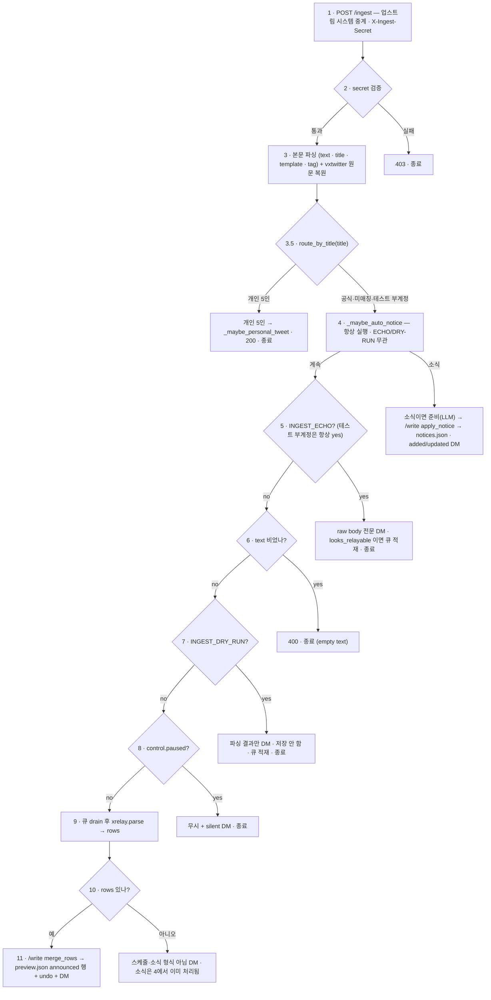

# ingest 신호 처리 경로 (현행)

업스트림 시스템(운영자 폰의 Automate 플로우)은 팔로우한 계정의 푸시 알림이 일정 양식(`android.bigText` 등)이면
**무조건** `POST /ingest`(`mewtype-telegram` 공개 서비스)로 중계한다. 로직 수정이나 새 POST
신설은 없다. 그 뒤 `_ingest()`(`src/backend/telegram_app.py`)가 들어온 텍스트를 **소식**·**스케줄**·
**버림**으로 분기한다.

> v2.8(개인 트윗)에서 3↔4 노드 사이에 `android.title` 분기가 추가됨 → `docs/plan/v2_8_personal_tweets.md`.
> v2.8.1: 개인 5인 분기가 배지(`tweets.json`) + **`parse_schedule` → `scheduled` 승격**(`schedule.json`) 둘 다 수행 → `docs/plan/v2_8_1_personal_schedule.md`.
> v3.1: `tweets.json` `tweets[ck]` 가 **배열(스레드, 최신이 뒤)** — `xtweet.merge_thread` 가 append·id중복 dedup·정렬·상한 초과분 아카이브(`rolled`). 예고 여부와 무관하게 본인 글은 스레드에 실린다. (상한은 v3.5.3 부터 `MAX_THREAD`=50.)
> v3.7.1: 아래 흐름의 **판단·외부 호출(외부 LLM·`videos.list`·vxtwitter·비전 OCR)은 전부 이 서비스(제어 채널)에서**,
> `data` 저장소 **콘텐츠 커밋만** 백엔드 `POST /write`(한 번에 1건) 에서 실행된다 — 아래 "어디서 실행되나" 참고.

## 들어오는 것 — `request.form` (또는 JSON)

| 필드 | 출처 | 뜻 |
|---|---|---|
| `text` | `nx.android.bigText` (없으면 `android.text`/`nmsg`/`nticker`) | 트윗 본문 |
| `title` | `nx.android.title` | 게시자 표시 이름 (리포스트·외부계정·계정 판별) |
| `template` | `nx.android.template` | `BigTextStyle` 등 — 폰 게이트가 사용 |
| `tag` | `nx.pde_noti_tag` | 트윗 태그 → `x.com/i/status/<id>` · 중복제거 키 |

## 흐름

세로 척추 = "계속 진행" 경로, 옆으로 빠지면 그 단계에서 응답하고 **종료**.
3.5번(개인 5인 분기)과 4번(`_maybe_auto_notice`)은 게이트보다 앞이고 ECHO/DRY-RUN 과 무관하게 돈다
(4번은 paused 와도 무관).

## 단계 상세

1. **`POST /ingest`** — 업스트림 시스템이 팔로우 계정 푸시 알림을 양식만 맞으면 무조건 중계. 헤더 `X-Ingest-Secret`.
2. **시크릿 검증** — `X-Ingest-Secret == INGEST_SECRET` 아니면 `403`, 그 외 통과.
3. **본문 파싱** — raw body 를 form 파싱 전에 캐시 → `text/title/template/tag` 추출 + 폰 Automate 의
   `urlEncode` 딕셔너리 버그 우회(본문이 폼 키로 새는 경우 복구). 이어서 `tag` 에서 tweet id 를 뽑을 수 있으면
   `_recover_raw_via_vxtwitter` 로 vxtwitter 원문을 정본으로 교체(실패 시 폰 원문).
3.5. **`xtweet.route_by_title(title)`** — `config/channels.json` `x_names` 에 맞는 개인 5인이면
   `_maybe_personal_tweet` → 200 으로 즉시 종료(아래 4번 이하 안 탐). 테스트 부계정(`INGEST_TEST_TITLES`,
   기본 `jehy`)은 5번을 강제 ECHO 로 통과. 공식·미매칭은 그대로 4번.
4. **`_maybe_auto_notice()`** — ECHO/DRY-RUN·paused 와 **무관하게 여기서 항상**. 순수 `xnotice.parse`
   가 소식이 아니면 GitHub 는 안 건드림. 소식이면 `_prepare_notice`(비전 OCR·제목추출 LLM·같은 날짜
   의미 중복판정 LLM) → `/write` `notice_sweep` + `apply_notice`(`_commit_notice` → `notices.json`),
   `added`/`updated` 만 DM.
5. **`INGEST_ECHO`** on → raw body 전문을 청크로 DM + `xrelay.looks_relayable` 이면
   `ingest_queue.json` 적재 → 즉시 종료(파싱·저장 없음).
6. **`text` 비었으면** `400` + 계측 로그.
7. **`INGEST_DRY_RUN`** on → `xrelay.parse` 결과·인식실패 줄만 DM + 큐 적재 → **저장 없이** 종료.
8. **`control.json` 의 `paused`** → 무시 + silent DM → 종료.
9. **`/write ingest_queue_drain`**(테스트 기간에 쌓인 큐 반영) + `xrelay.parse(raw)` → `rows`
   (일일 `配信スケジュール` 또는 `出演情報`).
10. **`rows` 유무 분기.**
11. 예 → `/write merge_rows`(`_merge_rows_into_schedule` → `xrelay.merge_announced`) → `preview.json` 의
    `announced` 행 반영 + `admin_state.json` undo 스냅샷 + `xrelay.summary_text` DM.
12. 아니오 → "스케줄·소식 형식 아님" 안내 DM (소식은 4에서 이미 처리 — 여기선 아무 것도 저장 안 함).

## 어디서 실행되나 (v3.7.1)

`/ingest` 는 제어 채널(`mewtype-telegram`, 동시 처리 80)이 받는다. 요청끼리 GitHub 커밋이 겹치면 409 가 나므로
(브랜치 HEAD 단위 충돌) **콘텐츠 커밋은 백엔드 `/write`**(`concurrency=1`) 에 한 줄로 보내고, 느린 외부 호출은
**제어 채널에서 요청마다 병렬로** 먼저 끝낸다. 상세 표: `docs/SPEC.md` §8.14.

| 경로 | 제어 채널 | 백엔드 `/write` 잡 |
|---|---|---|
| 개인 트윗(3.5) | `_prepare_personal_tweet`(vxtwitter 미디어·파싱·번역 LLM) → 커밋 후 DM → `_maybe_personal_schedule`(아래) | `personal_tweet` = `_commit_personal_tweet`(`tweets.json` + 모니터 로그) |
| 개인 예고 — 유튜브 URL | `videos.list`·(외부 채널이면) 참여판정 LLM·아이템 생성 | `url_confirmed_commit`(`preview.json` + undo + Cloud Tasks wake 즉시 등록) |
| 개인 예고 — 비유튜브 URL | `_prepare_notice` | `notice_sweep` + `apply_notice` |
| 개인 예고 — URL 없음 | `parse_schedule` + `announces_own_broadcast` LLM | `merge_rows`(personal) |
| 소식(4) | `_prepare_notice` | `notice_sweep` + `apply_notice` |
| 스케줄(9~11) | `xrelay.parse` | `ingest_queue_drain`, `merge_rows` |

제어 채널이 직접 커밋하는 것(큐 우회, 충돌 가능성 남음): `relay`/`notice` 모니터 로그, degraded 기록,
`admin_state.json` 마법사 단계, `control.json`.

## 별개 경로

- **`/telegram` 웹훅** — 운영자 명령(`/status /pause /resume /log /list /del /ingest /notice
  /notice-del /notice-list /undo`). 대부분 트윗 인입과 무관하지만 **`/ingest`(무인자 →
  다음 메시지/파일로 원문)** 는 예외로 트윗을 받는다. `_handle_manual_ingest` 가
  `xrelay.parse`(@BDP 일일 스케줄 / `出演情報`)를 먼저 시도하고, 행이 안 나오고 인식
  실패 줄도 없으면 **`_try_personal_ingest`** 로 폴백한다 (멤버 개인 예고 트윗):
  - 본문에 **온전한 YouTube URL 이 있으면** `videos.list`(quota 1) 로 `channelId`
    → 5인 `channel_key` 판별.
  - URL 이 없거나 채널을 못 정하면(영상 비공개 · 링크 잘림 · `YOUTUBE_API_KEY` 미설정
    · 5인 채널 아님) `admin_state.pending_member` 슬롯에 원문을 넣고 **유닛을 되묻는다**
    (`[1]아라레 … [5]미야코`, 취소 `aNoneTokyo`, TTL 5분). 운영자가 `1~5`/이름으로
    답하면 `_handle_member_followup` 이 그 `channel_key` 로 재처리.
  - 채널이 정해지면 `xtweet.parse_schedule`(게이트 = `配信` 계열 + 날짜/URL) →
    `merge_personal_schedule` 로 `schedule.json` 의 `scheduled`(`source:"personal"`) 행
    + undo 스냅샷 + DM. 업스트림 시스템의 `_maybe_personal_schedule`(android.title 로 채널을
    아는 경로)와 결과가 같다. (위 서술의 `schedule.json`/`scheduled` 는 v2 이름 — v3 는 `preview.json` 의
    `announced` 아이템, 커밋은 `/write merge_rows`.)
  - **(v3.6)** `_maybe_personal_schedule` 자체가 3단 분기로 재설계됨 — 유튜브 URL 있으면
    `videos.list` 로 즉시 확정(API 실패 시만 이 텍스트 파싱으로 폴백), 비유튜브 URL 있으면
    소식(`notices.json`)으로 이관, 어느 쪽도 아니면 위 텍스트 게이트를 타되 등록 직전
    LLM(`announces_own_broadcast`) 최종 확인을 한 번 더 거친다. 상세 흐름도:
    `docs/v3_pamphlet.html`(devpapers) "개인 트윗 예고 판정" 섹션, 요약: `docs/VERSION.md` v3.6.
- **현재 플래그 전제** — v2.7 소식 자동 인입이 운영 중이므로 `INGEST_ECHO=0` · `INGEST_DRY_RUN=0`
  (실배포) 상태. 즉 5·7번 게이트는 통과, 4번과 9~12번이 실제 경로.
