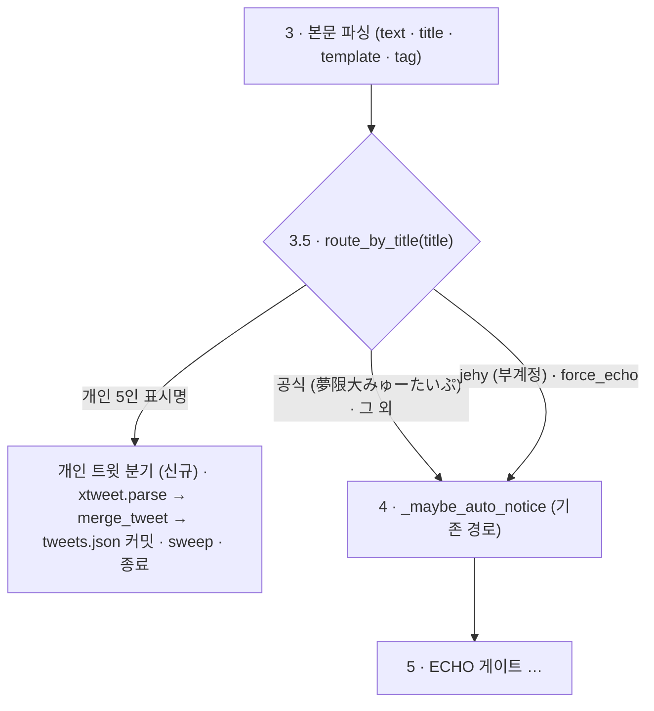

# v2.8 — 멤버 개인 트윗 (예고판 상단 편지 배지)

작성 2026-09-07. v2.3(X 릴레이)·v2.7(소식 게시판) 위에 얹는다.
현재 상태: **설계**. UI 목업: https://claude.ai/code/artifact/951c48ed-8944-4a62-9847-93680ad3d1eb
현행 ingest 경로: `docs/INGEST_FLOW.md`

---

## 0. 배경

외부 백엔드(폰 Automate)가 팔로우 계정을 **7개**로 늘렸다 — 개인 5 + 공식 채널 + 테스트 부계정.
알림이 일정 양식이면 지금과 **똑같이** `POST /ingest` 로 들어온다(외부 백엔드 로직·엔드포인트
변경 없음). `android.title`(게시자 표시 이름)로 라우팅해, 개인 5인의 트윗은 새 파이프라인으로
빼서 예고판 상단에 "편지 배지"로 노출한다. 팬이 배지를 누르면 그 멤버의 **가장 최근 트윗 원문**을
말풍선(PC)·토스트(모바일)로 본다. 24시간 지나거나 더 최신 트윗이 오면 교체·소멸.

메인 콘텐츠(5인 유닛 스케줄)를 가리지 않는 게 최우선 — 소식 티커(v2.7)와 같은 원칙.

## 1. ingest 라우팅 — 3↔4 노드 사이 `android.title` 분기 (신규)

`docs/INGEST_FLOW.md` 의 3번(본문 파싱)과 4번(`_maybe_auto_notice`) 사이에 조건부 노드 삽입.



| `android.title` | route | 처리 |
|---|---|---|
| `夢限大みゅーたいぷ` | `official` | **기존 그대로** — 4번(`_maybe_auto_notice`) → 5~12번. 소식/스케줄 파이프라인. |
| `仲町あられ` | `arale` | **신규** — 개인 트윗 분기, 처리 후 `return`(4번 이하 안 탐). |
| `藤都子` | `miyako` | 〃 |
| `千石ユノ` | `yuno` | 〃 |
| `宮永ののか🐰🩹` | `nonoka` | 〃 (표시명 뒤 이모지·장식은 매칭에서 무시) |
| `峰月律` | `ritsu` | 〃 |
| `jehy` | `test` | 4번으로 **가되** `force_echo=True` → 5번에서 `INGEST_ECHO` env 와 무관하게 **무조건 ECHO 처리**(raw body DM 회신, 실제 parse·저장 없음). |
| 그 외 | `official` 취급 | 안전 기본값 — 기존 경로. |

### 매칭 규칙

- `title` 을 `_strip_decor`(공백·이모지·기호 제거, 소문자화) → `config/channels.json` 의
  `x_names[]` 중 하나로 **시작하거나 포함**하면 그 `channel_key`.
- 테스트 title 목록은 env `INGEST_TEST_TITLES`(쉼표 구분, 기본 `jehy`). **상시 유지** —
  외부 백엔드가 죽었을 때(예: `socket closed`) 부계정에서 알림 한 번 보내 릴레이·백엔드가
  살아있는지 확인하는 헬스체크 훅. 테스트 끝나도 제거 안 함.
- 공식 채널명 `夢限大みゅーたいぷ`·`ゆめみた` 은 `_OFFICIAL_NAMES` 로 명시(=기본 official).
- `title` 이 비어 오면(일부 RT/원글 알림) → `official` 로 폴백(기존 경로).

## 2. 개인 트윗 분기 로직 (`_maybe_personal_tweet`)

`_maybe_auto_notice` 와 같은 꼴. **paused·ECHO·DRY-RUN 과 무관하게** 이 분기에 오면 실행.

1. `xtweet.parse(text, title=title, tag=tag, channel_key=ck, now_iso=now)` → 트윗 dict (또는 None).
   - `text` 비었으면 None.
   - 리트윗/리플라이 필터: 지금은 안 함(폰 게이트가 다운로드·미디어·그룹요약은 이미 차단).
     `RT @` 로 시작하는 본문이 노이즈면 그때 스킵 추가 — `ponytail:` 로 표시.
2. `gh = _make_gh()` → `tweets.json` 읽기 → `xtweet.merge_tweet(prev, incoming, now)` →
   `(new, changed, mode)`.
   - mode ∈ `added` | `replaced` | `dup` | `stale`.
   - 같은 `channel_key` 슬롯에 이미 있고 `id` 같음 → `dup`(no-op).
   - 이미 있고 `id`(Snowflake) 가 더 큼 → **교체** → `replaced`. (Snowflake 는 시간순 단조 →
     릴레이 순서가 뒤바뀌어도 안전. 합성 id 는 `received_at` 비교로 폴백.)
   - 없음 → `added`.
   - 들어온 게 이미 24h 초과(`received_at`) → `stale`, 저장 안 함.
3. 교체(`replaced`)면 밀려난 기존 트윗을 `tweet_archive.json` 에 append(로깅용). `changed` 면 커밋.
   이어서 `xtweet.sweep_expired` 로 24h 지난 슬롯도 `tweet_archive.json` 으로 이관(별도 커밋).
4. DM: `added`/`replaced` 만 한 줄(`🐦 <이름> 새 트윗`, silent). `dup`/`stale` 은 로그만.
   (undo 는 v2.8 초기엔 생략 — 24h 휘발이라 위험 낮음.)
5. `return jsonify({"ok": True, "personal": mode}), 200` — 4번 이하 안 탐.

## 3. 데이터 계약 — `tweets.json` (data 브랜치 루트)

`docs/SPEC.md` 에 **계약 I** 로 추가.

```jsonc
// tweets.json
{
  "generated_at": "2026-09-07T...Z",
  "tweets": {
    "arale": {
      "channel_key": "arale",
      "id": "2096552878769152326",          // 트윗 Snowflake id (tag 에서). 없으면 "p"+sha1(...)[:15]
      "text": "おはよう！今日は22時から歌枠やります🎤",  // 원문 (normalize, 여는줄/닫는줄 장식 제거, 최대 600자)
      "url": "https://x.com/i/status/2096552878769152326",  // tag 에서. 합성 id 면 null
      "handle": "arale_yumemita",           // config/channels.json
      "received_at": "2026-09-07T12:03:11Z",// 릴레이 도달 시각 (실제 트윗 시각은 안 옴)
      "expires_at": "2026-09-08T12:03:11Z"  // received_at + 24h. 프론트·sweep 공통 기준
    }
    // 채널당 최대 1건. 24h 안에 트윗 없으면 키 자체가 없음.
  }
}

// tweet_archive.json — 만료·교체로 내려간 트윗 로그 (append-only, id dedupe)
{ "tweets": [ { /* 위 필드 + */ "archived_at": "...Z", "archived_reason": "expired" | "replaced" } ] }
```

- 정렬 필요 없음(맵). 직렬화는 전 모듈 공통 규칙(`sort_keys=True, indent=2, ensure_ascii=False` + 끝 개행).
- `tweet_archive.json` = `pending.json`/`archive.json` 처럼 지나간 상태를 로깅으로 남기는 짝.
  프론트는 안 읽는다.

## 4. 파서·계약 모듈 (`src/backend/xtweet.py`)

`xnotice`+`notices` 처럼 두 파일로 쪼갤 만큼 안 복잡해서 **한 파일**. 순수 함수. self-test `python -m src.backend.xtweet`.

- `route_by_title(title, channels_cfg, *, test_titles=()) -> str` — `"official"` | `<channel_key>` | `"test"`.
- `parse(text, *, title, tag, channel_key, now_iso, handle="") -> dict | None` — 위 계약의 1건 dict.
- `default_tweets() -> dict` · `default_archive() -> dict`
- `merge_tweet(prev, incoming, now_iso, *, archive=None) -> (new_tweets, new_archive, changed, mode)`
  — mode ∈ `added` | `replaced` | `dup` | `stale`.
- `sweep_expired(prev, archive, now_iso) -> (new_tweets, new_archive, removed_keys)`
- `summary_line(t) -> str` — DM 용 한 줄.

## 5. 프론트엔드 (`src/frontend/js/tweets.js` + `css/tweets.css`)

목업 로직 이식. `notices.js` 와 같은 "poll 마다 호출, 시그니처 같으면 no-op" 패턴.

- `config.js` 에 `TWEETS_URL`(= `data/tweets.json`) 추가. `main.js` 가 `POLL_MS`(75초)로 폴링 →
  `applyTweets(data)`. **그리고 `renderBoard()` 직후에도 매번 호출**(보드가 통째 재생성되면
  배지가 날아가므로 — `main.js` 의 3개 `renderBoard` 호출부를 얇은 래퍼로 감싸거나 직후 호출).
- **배지**: `tweets.js` 가 각 `.lane[data-channel=ck] .lane__header .lane__link` 안(아바타 우상단)에
  `<button class="lane__tw">` 삽입/갱신/제거. `#board` 에 이벤트 위임(캐러셀 클론이 리스너를 복제
  안 하므로). 팝오버·토스트는 **전역 재사용 노드 1개씩**(레인마다 만들지 않음).
- 모양: 파란 편지 아이콘(`#CCFBFA`). 안 읽음 = 꽉 찬 편지 + 글로우 펄스 + 콩콩 점프,
  읽음 = 외곽선만·흐리게. 읽음 상태 = `localStorage`(`mew:twread` = `{ "<id>": 1 }`, 매 렌더에
  현재 없는 id 는 정리, try/catch).
- **PC**: 아바타/배지 호버 동안 말풍선 펼침(`scale(.94)→1` + 페이드, 0.2s). 클릭하면 고정(X 버튼
  등장), X·Esc·바깥탭으로 접힘(재렌더 없이 클래스만 토글해 접힘 애니 유지). **여러 유닛 동시 열림
  허용** — 각자 레인 폭 안에서만 펼쳐져 안 겹침. 트윗 없을 때 아바타 클릭 = 기존대로 유튜브,
  트윗 있으면 이름 클릭만 유튜브.
- **모바일**: 배지 터치(`pointerdown`→`pointerup` 이동 10px 이하 = 탭) → 상단에서 메신저 알림처럼
  토스트 슬라이드. 백드롭 어두워지고 뒤 요소 `pointer-events:none`. X·백드롭 탭으로 닫힘.
- **배경색**: 그 유닛의 `--lane-color`(예고판 헤더 그라데이션이 아바타에서 추출해 넣는 값)를 그대로
  재사용. 글자색은 `--lane-color` 상대휘도로 흰/검 자동. 아직 샘플링 전이면 다음 poll 에서 반영.
- **만료**: `expires_at` 지난 트윗은 프론트에서도 숨김(백엔드 sweep 지연 대비). 폴백 채널 메타는
  `config.js` 것 재사용.
- 404/빈 `tweets.json` → 배지 아무것도 안 띄움(소식 티커처럼 빈 막대 유지하는 것과 다름 — 자리 안 잡음).
- 로컬 개발: `fixtures/tweets.sample.json`(`expires_at` 2099). `config.js` URL 교체.

## 6. 관련 파일

- 백엔드: `src/backend/xtweet.py`(신규) · `telegram_app.py`(`_maybe_personal_tweet`/`_tweet_sweep`
  + `_ingest` 3.5 분기 + jehy `force_echo` + `xtweet` import). self-test `python -m src.backend.xtweet`.
- 설정: `config/channels.json` — 개인 5채널에 `x_names: [...]` 추가.
- 프론트: `src/frontend/js/tweets.js`·`css/tweets.css`(신규) · `js/config.js`(`TWEETS_URL`) ·
  `js/main.js`(`pollTweets`+재적용) · `index.html`(`<link>` 추가).
- fixtures: `fixtures/tweets.sample.json`.
- data 브랜치: `tweets.json` · `tweet_archive.json`(코드 없음).
- 문서: `docs/SPEC.md` 계약 I + §8 라우팅 갱신, `docs/INGEST_FLOW.md`, `docs/ARCHITECTURE.md`, `docs/VERSION.md`.

## 7. 테스트 부계정 (`jehy`) — 상시 유지

외부 백엔드가 이유 불명으로 죽는 경우가 있다(관측: `socket closed`). 부계정에서 알림을 한 번
보내 `릴레이 → POST /ingest → 백엔드 → DM` 왕복이 살아있는지 확인하는 **상시 헬스체크 훅**.
`route=="test"` → 4번은 거치되 `force_echo=True` 로 5번에서 무조건 ECHO(raw body DM), 실제
파싱·저장은 안 함. env `INGEST_TEST_TITLES`(기본 `jehy`) 로 부계정명 지정. 제거 예정 없음.

## 8. 명시적 비목표 (v2.8 초기)

- Cloud Tasks / `pending.json` / statemachine 안 탐 (소식과 동일 — 폴링 없음).
- `/undo`·`/tweet-del` 등 수동 관리 명령 없음. 필요해지면 추가.
- 리트윗/인용/리플라이 구분 없음. 노이즈 심하면 `RT @` 스킵부터.
- 실제 트윗 게시 시각 미확보 → 상대시간 라벨은 "받은 지 N시간" 성격. 24h TTL 도 릴레이 기준.
- 다이제스트 DM 없음(건별 한 줄).
