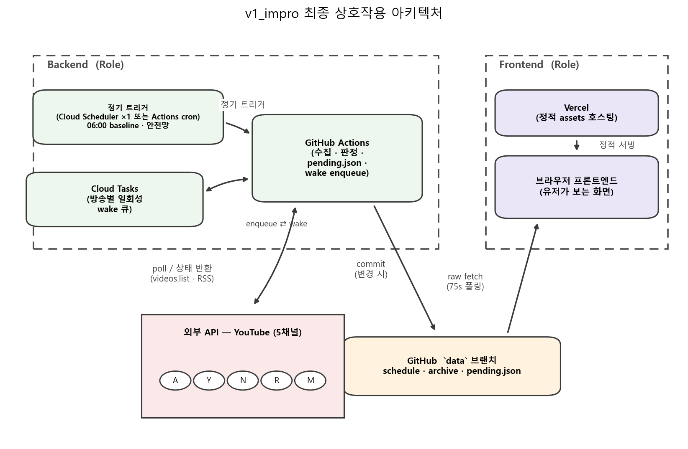
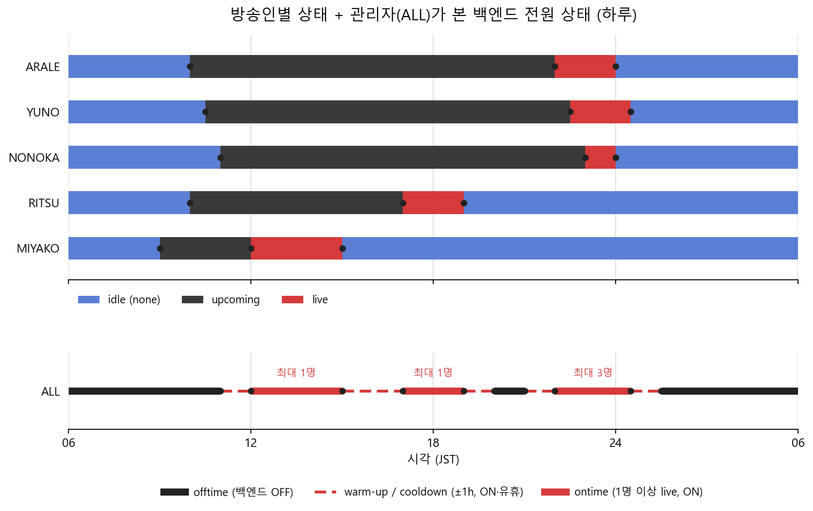

# 최종 아키텍쳐 구상도


## Backend (Role)

- **정기 트리거** — Cloud Scheduler 1잡 또는 GitHub Actions `schedule:` cron 중 하나.
  Cloud Tasks 자체엔 반복 스케줄이 없으므로 이 정기 트리거가 반드시 별도로 필요.
  GCS를 아예 안 쓰려면 이 항목을 Actions cron 으로.
  - **JST 06:00 1회** — 일일 baseline 동기화(RSS + reconcile + 아바타 갱신). 방송인 전원 idle 시간대라 부담 없음.
  - **안전망** — 아래 Cloud Tasks 체인이 끊겨도(=다음 wake enqueue 실패) 이 정기 실행이 상태를 다시 굴려 복구. 06:00 1회만이면 복구까지 최대 ~24h stale (→ "미결" 참고).
  - cron 정시성은 중요치 않음(baseline·안전망 용도, ±15분 지터 무방).
- **Cloud Tasks** — 방송별 정밀 wake 큐. 백엔드가 매 실행 끝에 다음 필요 시각(예: `scheduled_start − 15분`)으로 태스크 1개를 `scheduleTime` 지정해 enqueue. 도달 시 백엔드 HTTP 엔드포인트를 1회 호출.
  GCS cron과 달리 "특정 일시 1회"를 표현 가능.
- **GitHub Actions (백엔드 로직)** — 트리거(정기 또는 Cloud Tasks)를 받아:
  5채널 상태 확인 → `pending.json` · `schedule.json` 갱신 → 다음 wake를 Cloud Tasks에 enqueue → 종료.
  - 5명 임박·라이브 확인은 **배치 `videos.list` 1회**(id 최대 50개)로. 채널별 개별 호출 금지.
  - 시각 비교·저장은 전부 **UTC**.
  - 관리자 인스턴스는 휘발성(Cloud Run scale-to-zero) — 진행 상태는 전부 `pending.json`에.

## Frontend (Role)

- **Vercel** — 서빙용 정적 웹페이지 + 디자인 + JS. 데이터는 안 거침.
- **브라우저** — Vercel이 서빙한 화면. 75초마다 `data` 브랜치를 raw fetch 해 현 상태 갱신.

## ETC

- **`data` 브랜치** — GitHub Actions가 변경 시에만 commit. `schedule.json` · `archive.json` · **`pending.json`**.
- **외부 API** — YouTube Data API v3. 하루 10,000 유닛.
  - `videos.list` = **1유닛**(배치) — 상시 사용(상태 확인).
  - `search.list?eventType=upcoming` = **100유닛/채널** — 라우틴 아님. RSS가 예고를 놓친 게 확인될 때만 fallback (§upcoming 감지).

---

# 상태 저장 — `pending.json`

`data` 브랜치 루트. 진행 중인 방송별 폴링 상태를 영속화.

```jsonc
{
  "updated_at": "2026-08-31T12:00:00Z",
  "entries": {
    "<video_id>": {
      "channel_key": "arale",
      "phase": "pre-live",                         // "pre-live" | "live-watch"
      "scheduled_start": "2026-08-31T13:00:00Z",   // 최신값(변동 시 갱신)
      "actual_start": null,
      "next_check_at": "2026-08-31T12:45:00Z",      // 이 시각에 Cloud Task 도달 예정
      "attempts": 0
    }
  }
}
```

- `upcoming` 감지 시 `phase="pre-live"` 엔트리 생성, `next_check_at = scheduled_start − 15분`.
- `live` 확인 시 `phase="live-watch"`, `actual_start` 기록.
- `none`(종료) 확인 시 엔트리 삭제 + `archive.json` 이관.
- 매 실행: `next_check_at <= now` 인 엔트리만 처리 → 갱신 → 다음 `next_check_at` 계산 → Cloud Task enqueue.

---

# 백엔드 생명주기 및 관리자 인스턴스


- 5채널 각각 RSS 피드로 upcoming 감지. 감지 시 idle → upcoming 전환, 프론트 업데이트.
- 5채널 live 상태의 **합집합**으로 관리자 인스턴스가 백엔드 켜짐/유휴/꺼짐 결정:
  - live 1명 이상 → **ontime (ON)**
  - 예정 live ±buffer(warm-up/cooldown) 구간 → **ON · 유휴**
  - 그 외 → **OFF** (Cloud Run scale-to-zero)
- buffer는 보수적으로 잡을 필요 없음. Cloud Run 콜드스타트 1~2초라 `T−15분`이면 충분.

---

# 백엔드 로직

## 상태 정의
- **idle** : 방송 예고 미확인 + 라이브 아님.
- **upcoming** : 라이브 아님 + 다음 방송 예고 존재. **기간 무관**(며칠~몇 주 뒤 예약도 upcoming).
  "24시간 이내" 등 구간 구분은 프론트 표시(today/week/month/later 버킷)의 몫이지 백엔드 상태가 아님.
- **live** : 예고된 방송을 라이브로 진행 중.

## upcoming 감지
1) RSS 수집 : videoId, title, thumbnailURL 등. (쿼터 0)
2) 신규/변경 예고는 `videos.list`(배치)로 상태 확인 → `none→upcoming` 이면 `schedule.json` · `pending.json` 갱신, 프론트 업데이트.
3) `pending.json` 엔트리 생성(`phase="pre-live"`, `next_check_at = scheduled_start − 15분`) → 그 시각으로 Cloud Task enqueue → 이 로직 종료.

- **deep scan (`search.list`)은 라우틴 아님.** RSS 창(채널당 최근 15개) 밖 장기 예약을 놓친 게 확인될 때만 fallback. 100유닛/채널이라 남발 금지.

## upcoming 시작 직전 (Cloud Task 도달 시)
* `videos.list`(배치)로 live 여부 확인 — 미리 켜는 경우 포착 목적. live면 `phase="live-watch"`, `actual_start` 기록, 프론트 업데이트 후 아래 "live 이후"로, 이 로직 종료.
1) `scheduled_start − 15분` : 호출. 미시작 → 2).
2) `scheduled_start` 시점 : 호출. 미시작 → 3).
3) 이후 **3분 간격** 호출. 시작되면 종료. `scheduled_start + 60분` 경과했는데 미시작 → fallback.

### fallback
1) `videos.list part=liveStreamingDetails` 로 `scheduledStartTime` 변동 확인 (별도 엔드포인트 아님, 같은 호출).
2) 변동 O → `pending.json`의 `scheduled_start` 갱신 → 새 시각 `−15분`으로 Cloud Task 재enqueue → 종료.
3) 변동 X → 이후 1시간마다 1)부터 재시도. `live_state` 가 `none` 또는 `live` 로 확정될 때까지.

## live 이후
1) live 시작 ~ `+60분` : **30분 간격**으로 `videos.list`의 `liveBroadcastContent` 확인 (60분 미만 방송도 놓치지 않기 위함).
2) `+60분` 이후 : **3분 간격** 확인.
3) `live` → 다음 주기에 다시 확인.
4) `none` → 종료(idle) 판정 : `schedule.json`에서 제거 + `archive.json` 이관, 프론트 업데이트, `pending.json` 엔트리 삭제, 로직 종료.

---

# 미결 / 참고

- **안전망 주기**: 06:00 1회만이면 Cloud Tasks 체인 단절 시 복구까지 최대 ~24h. 정기 트리거를 2~3시간 간격 light sync 로 병행하면 worst-case staleness ~2~3h (쿼터 ~2유닛/회). → 채택 여부 미결.
- **정기 트리거 구현체**: Cloud Scheduler 1잡 vs Actions cron — 확정 필요.
- **compute 위치**: Actions 러너(~2~3분 준비 오버헤드, 굵은 주기엔 OK) vs Cloud Run(콜드스타트 1~2초, 촘촘한 3분 폴링까지 감당) — "live 이후" 3분 폴링을 실제 돌릴지에 따라 결정.
