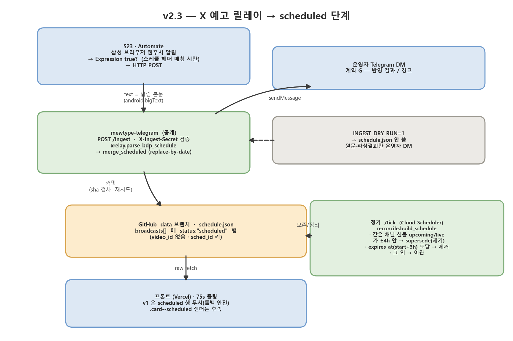

# v2.3 — X 예고 릴레이 → `scheduled` 단계

작성 2026-09-03. 초안에서 출발해 **백엔드 인입 경로는 구현 완료**(아래 §구현 반영).
PR3(v2.2) 브랜치 위에 구현. 계약(scheduled 행·DOM)은 `docs/SPEC.md` §1-1·§3 에 반영됨.



*(그림 생성기: `docs/plan/gen_x_relay.py` — `python docs/plan/gen_x_relay.py`)*

---

## 구현 반영 (2026-09-03, 1차)

초안 대비 실제 구현에서 바뀐 것:

| 항목 | 초안 | 구현 |
|------|------|------|
| 인입 경로 | 폰 → 텔레그램 `/update` 명령 → 메인 `/ingest`(OIDC) | 봇은 자기 메시지를 webhook 으로 못 받음. → **폰(Automate) → `mewtype-telegram` 공개 `POST /ingest` 직접**. `X-Ingest-Secret` 헤더(=env `INGEST_SECRET`) 인증. form/JSON 의 `text` 필드 |
| writer | 메인 서비스 단일 writer (telegram 은 schedule.json 안 씀) | `mewtype-telegram` 이 `schedule.json` 을 **직접** read-merge-write. `gh_store` 의 base-sha 검사 + 1회 재시도로 경합 방어. ingest 는 하루 수 건이라 tick 과 충돌 드묾. `# ponytail`: 충돌 잦아지면 OIDC 로 메인에 위임 |
| 파서 B(멤버 개인 트윗) | 이번 범위 | **후속.** 파서 A(`@BDP_yumemita` 일일 스케줄)만 구현 |
| 프론트 `.card--scheduled` | 이번 범위 | **구현됨.** `render.js` 가 `upcoming` 과 같은 버킷에 시각순으로 섞어 그림. 점선·감광 카드, `icon`, "예고" 배지, 카운트다운 강조·지각표시 없음, `channel_url` 링크. 구버전 프론트는 무시(롤백 안전) |
| `/tick` kick on ingest | fire /tick 1회 | **안 함.** 다음 light tick(≤3h)의 reconcile 이 실물 upcoming 을 supersede |
| `source_tweet_at` / `truncated` 필드 | 스키마에 있음 | 필드명 `source_at` 로. `truncated` 는 미구현(§11 참고) |

**구현 파일**: `src/backend/xrelay.py`(신규, 파서+머지, self-test), `src/backend/telegram_app.py`
(`POST /ingest`), `src/collector/reconcile.py`(`build_schedule` 에 scheduled 보존/supersede/TTL),
`deploy/setup.sh`·`deploy/deploy_telegram.sh`(`INGEST_SECRET`).

**DRY-RUN / ECHO**: `INGEST_DRY_RUN` 이 참이면 `/ingest` 는 `schedule.json` 을 안 쓰고 원문 +
파싱 결과만 DM 회신. `INGEST_ECHO` 가 참이면 파싱조차 안 하고 받은 텍스트만 DM 회신
(+ `tail_ok` 잘림 계측 로그). 미해결 #1(푸시 잘림) 검증용. 두 모드 중 온 스케줄 트윗은
`ingest_queue.json` 에 쌓였다가 실배포 전환 시 drain 된다. **전환 절차·판정은
`docs/plan/v2_4_golive.md`.** 현행 전체 그림 `docs/plan/v2_4_flow.png`.

### 폰(Automate) 플로우 — 아래는 v2.3 설계 초안 (구버전)

> **현행 구성·실측은 `docs/plan/v2_4_golive.md` "구성요소 · 외부 · 운영자 폰" 참고.**
> 바뀐 것: 문자열 연결은 `+` 가 아니라 **`++`** (LlamaLab Automate) — 아래 `+` 는 `NaN` 이 된다.
> body 는 `urlEncode({"text": coalesce(nx["android.bigText"], nx["android.text"], nmsg, nticker, "")})`
> (커밋 `1c21d9a` 기준, 2026-09-04 확정). `||` 는 이 폰 빌드에서 빈값만 보내 `coalesce` 로.
> 이 빌드는 `urlEncode({"text": ...})` 의 값을 키 자리로 흘려서, 백엔드가 폼 키에서 원문을
> 복구한다 (`telegram_app.py` `_ingest`, `# ponytail:`). 내용은 `bigText`/`android.text` 에 옴.
> 테스트 기간엔 `Expression true?` 필터 생략(전부 relay), 실배포 시 `配信スケジュール`/`出演情報` 마커로 복원.

```
Flow beginning
  → Notification posted?   package = "com.sec.android.app.sbrowser"
                           out: pkg, ntitle, nmsg, nticker, nx(=dictionary of extras)
        (Y: 다음 / N: 자기 자신으로 루프백)
  → Expression true?       matches(coalesce(nx["android.bigText"], nx["android.text"],
                                            nmsg, nticker), "(?s).*配信スケジュール.*")
        (Y: 다음 / N: Notification posted? 로 루프백)
  → HTTP request           POST  <telegram URL>/ingest
                           content-type: application/x-www-form-urlencoded
                           headers (dict):  {"X-Ingest-Secret": "<INGEST_SECRET>"}
                           body: "text=" + urlEncode(coalesce(nx["android.bigText"],
                                   nx["android.text"], nmsg, nticker))
                                 + "&title=" + urlEncode(coalesce(ntitle, ""))
        → Notification posted? 로 루프백
```

- Automate 최신판에서 조건 분기 블록 이름은 **`Expression true`** (구 `Decision`). `find()` 없음 → `matches()`.
- 헤더 딕셔너리 리터럴은 이 빌드에서 `{ }` 표기가 통했다(`[ ]` 는 저장 거부).
- 다운로드 등 스케줄 아님 알림은 `Expression true?` 에서 걸러져 `/ingest` 안 감. 백엔드 파서 필터는 2중 안전장치.

### 검증 상태 (2026-09-03)

| 항목 | 상태 |
|------|------|
| 백엔드 `/ingest` 파싱 (실측 4샘플) | ✅ curl `{"ok":true,"dry_run":true,"parsed":3}` + DM 정상 |
| `xrelay` / `reconcile` self-test | ✅ 통과 (supersede/TTL 포함) |
| 폰 → `/ingest` 인증 | ✅ `X-Ingest-Secret` 정정 후 403→통과 (빈 다운로드 알림은 `400 empty text` — 정상) |
| 폰 → 실물 `配信スケジュール` 트윗 왕복 + 잘림 여부(#1) | ⏳ 트윗 대기 중 (ECHO 모드, `tail_ok` 로그로 판정 예정) |
| 실사용 전환 (`INGEST_ECHO=0`+`INGEST_DRY_RUN=0`) | ⏳ #1 확인 후 — 절차 `docs/plan/v2_4_golive.md` |
| 프론트 `.card--scheduled` 렌더 | ✅ 구현 + fixture 로컬 확인 |
| (v2.4) 합동방송 `host="group"` + `.card--collab` 팬아웃 | ✅ 구현·배포 (`mewtype-backend`/`-telegram`), fixture 로컬 확인 |
| (v2.4) ingest 큐 (`ingest_queue.json` push/drain) | ✅ 구현·배포, curl 로 적재 확인 |

---

## 0. 목표

X(트위터) 방송 예고 트윗을 **운영자 스마트폰 웹푸시 알림 → MacroDroid → 텔레그램 → 백엔드**
경로로 릴레이해서, YouTube 에 아직 영상 리소스가 없는 방송도 **`scheduled` 단계**로 프론트에 노출한다.

### 왜 필요한가
- X 무료 자동 파싱·크롤링은 사실상 불가 (비공식 API 는 곧 밴 → 계정 정지). 조사 완료.
- YouTube 에 `upcoming` 리소스가 생기기 **전**, 또는 **회원전용이라 영영 안 생기는** 예고를
  잡는 유일한 경로가 트윗이다. (회원전용은 `videos.list`·RSS 로 원천적으로 안 보임 — 기존 한계.)
- 운영자가 대상 계정을 직접 팔로우 → 브라우저가 새 트윗마다 웹푸시 → 그 알림을 릴레이.
  X 입장에선 정상 팔로워 트래픽이라 밴 리스크 없음.

### 조사 결과 (2026-09-03, 실제 트윗 확인)
- **`@BDP_yumemita`(유닛 공식)가 매일 유닛 전체 라인업을 텍스트로 트윗.** 서식 반정형:
  ```
  🛸#ゆめみた
  8/30(日) 配信スケジュール
  🎮11:00〜 宮永ののか
  youtube.com/@nonoka_yumemi…
  💭21:00〜 峰月律
  youtube.com/@ritsu_yumemita
  🎤21:30〜／☀明日朝7:00〜 藤都子
  youtube.com/@miyako_yumemi…
  🎤22:00〜 仲町あられ
  youtube.com/@arale_yumemita
  【メン限】23:00〜 千石ユノ
  ...
  ※時刻は予告なく変更の場合がございます。
  #バンドリ #ゆめみた
  ```
  - 헤더: `M/D(曜)の?\s*配信スケジュール` (`の` 유무 변동, 뒤에 🌟 장식 가끔)
  - 엔트리 = 2줄: `[아이콘][【メン限】]HH:MM[頃]〜[／☀明日朝H:MM〜] 이름` + `URL 줄`
  - URL 은 `youtube.com/@handle`(videoId 없음) 또는 `watch?v=`/`live/`(videoId 있으나 `…` 로 잘림)
  - 아이콘 → 종류: `🎮`게임 / `💭`잡담 / `🎤`노래(추정) / `💪`합방·대결 / `☀`아침. **그 외는 미지.**
  - `【メン限】` = 회원전용
  - 건수 1~5개/일 (Sep 2 는 1개). 아침·저녁 랜덤 시각에 게시, 당일치 또는 당일+내일치.
- **멤버 개인 계정 예고는 서식 제각각** (`⋱配信予定⋰` / `【今日の配信】` / 자유문). 파서 B 로 보조.
- `cdn.syndication.twimg.com/tweet-result?id=<ID>` 는 키 없이 전체 본문+펼친 URL 반환(작동 확인).
  단 **트윗 ID 가 있어야만** 쓸 수 있고, 웹푸시 알림엔 URL·ID 가 없다(확인됨).
  `timeline/profile`(계정 최신글 목록) 엔드포인트는 **죽음**(200 빈 응답). → 릴레이는 **알림 본문 텍스트 자체**에 의존.

---

## 1. 상태 사다리

```
scheduled  →  upcoming  →  live  →  ended
(트윗만)      (YT 영상)
```

- `scheduled` = `schedule.json` `broadcasts[]` 의 **새 `status` 값**. `video_id` 없음.
- **Cloud Tasks / `pending.json` 안 씀.** video_id 가 없어 wake 를 걸 수 없고, 걸 필요도 없다.
  정기 `/tick` 이 실물 `upcoming` 을 찾거나 TTL 로 소멸시킬 뿐. → compute 비용 0 유지.
- 별도 데이터 파일 신설 없음. TTL·소스 등 부기(簿記)는 전부 행에.

---

## 2. 데이터 흐름

1. **S23 / MacroDroid** — 삼성 브라우저(패키지 `com.sec.android.app.sbrowser`) 알림 감지 →
   텔레그램 봇에 메시지 자동 전송:
   ```
   /update src=<계정핸들>
   <알림 본문 전체(자동 삽입 변수)>
   ```
   - 폴백: 푸시 본문이 잘려 오면 운영자가 X 앱/브라우저에서 전체 복사 → `/update` 로 수동 붙여넣기.
2. **`mewtype-telegram`(공개 webhook)** — `/update` 수신 → `message.chat.id` 허용목록 검사 →
   `control.json.paused` 면 ack 만 하고 폐기 → 아니면 **OIDC 토큰 발급해 메인 `POST /ingest`** 호출
   (`/resume` 이 메인 `/tick` 을 부르는 것과 같은 방식).
3. **메인 `/ingest {raw, src, source}`** — 전처리 → 파서 A/B 분기 → `scheduled` 행 생성 →
   `schedule.json` 커밋(**기존 단일 writer 경로 그대로** — telegram 서비스는 schedule.json 안 건드림,
   ef7df20 sha 경합 회피) → 알림 G.
4. **다음 정기 `/tick`** — `reconcile.build_schedule` 이 이전 `scheduled` 행을 입력에 포함해
   보존·머지. 실물 `upcoming`/`live` 가 뜨면 supersede, `expires_at` 지난 행 제거.
5. **프론트** — 기존 75s 폴링 무변경. `render.js` 에 `status=="scheduled"` 분기 추가.

---

## 3. 계약 A 확장 — `scheduled` broadcast 행

`schedule.json` `broadcasts[]` 에 아래 형태 행이 섞인다. 기존 `upcoming`/`live` 행과 같은 배열.

```jsonc
{
  "status": "scheduled",                              // 신규 값. 기존 "upcoming" | "live" 에 추가
  "channel_key": "nonoka",
  "sched_id": "sched:nonoka:2026-08-30T02:00:00Z",    // video_id 대체 키. "sched:{key}:{start-or-idx}"
  "video_id": null,
  "title": null,                                      // 트윗엔 방송 제목 없음
  "url": null,                                        // 없으면 프론트가 channels[key].channel_url 대체
  "thumbnail": null,
  "scheduled_start": "2026-08-30T02:00:00Z",          // JST 11:00 → UTC. 파싱 실패 시 null
  "start_approx": false,                              // 트윗에 頃 / 애매 표현이면 true
  "kind": "game",                                     // game|talk|song|collab|morning|unknown
  "icon": "🎮",                                        // 원본 이모지 항상 보존 (unknown 이면 프론트가 이것만 표시)
  "members_only": false,
  "collab_with": [],                                  // A×B 합방이면 ["arale"] 등 (channel_key 배열)
  "source": "bdp_schedule",                           // bdp_schedule | member_tweet | manual
  "source_tweet_at": "2026-08-30T01:05:00Z",          // 트윗 게시 시각(알 수 있으면), 없으면 수신 시각
  "truncated": false,                                 // 푸시 본문이 잘린 것으로 판단되면 true
  "first_seen": "2026-08-30T01:06:00Z",
  "last_updated": "2026-08-30T01:06:00Z",
  "assumed_live": false,                              // reconcile 이 예고 시각 지나면 true (회원전용 "방송 중 추정")
  "expires_at": "2026-08-30T05:00:00Z"               // scheduled_start + (회원전용 5h / 공개 3h). null 이면 first_seen + 18h
}
```

- **정렬**: `live` → `upcoming` → `scheduled` 순, 각 그룹 내 `scheduled_start` 오름차순(`null` 은 맨 뒤).
- `sched_id` 로 dedupe (video_id 자리). 시각 없으면 `sched:{key}:{source_tweet_at}:{line_idx}`.

---

## 4. 전처리 (`xrelay.normalize`)

파서 앞단 공통:
- 개행 통일(`\r\n`,`\r` → `\n`), 연속 공백 축소.
- 전각 숫자·콜론 → 반각 (`１１：００` → `11:00`), `～`/`〜`/`~` → `〜`.
- 이모지 variation selector(`️`)·skin-tone 제거 후 아이콘 매칭.
- `youtube\.com/(?:watch\?v=|live/)([\w-]{11})(?![\w-])` 온전 매치만 `video_id` 후보.
  `…`/`t.co` 만 있으면 videoId 없음으로 취급(만료 URL 해석 안 함).
- `/update` 첫 줄 `src=<핸들>` 파싱 → 멤버 개인 트윗 채널 판별에 사용.

---

## 5. 파서 A — `@BDP_yumemita` 일일 스케줄

**트리거**: `src` 가 `BDP_yumemita` **또는** 본문에 `/(\d{1,2})\/(\d{1,2})\(.\)の?\s*配信スケジュール/`.

```
base_date ← 헤더 M/D + 연도 추론(현재 월 기준, 12→1 은 내년). JST.
줄 순회:
  엔트리줄  /^([^\d【\s]{0,3})\s*(【メン限】)?\s*(\d{1,2}):(\d{2})(頃)?\s*〜(.*)$/
    이름 ← 그룹6 에서 부분매치 { あられ→arale, ユノ→yuno, ののか→nonoka, 律→ritsu, 都子→miyako }
    '×' 포함 → 첫 이름 = 주 channel_key, 나머지 → collab_with, kind = collab
    인라인 '／☀?明日朝\s*(\d{1,2}):(\d{2})' → base_date+1 로 같은 채널 2번째 엔트리 추가
    아이콘(그룹1) → kind: { 🎮:game, 💭:talk, 🎤:song, 💪:collab, ☀:morning }
      매핑 없는 이모지 → kind = "unknown", icon 은 그대로 보존
    members_only ← 【メン限】 존재
    다음 줄이 youtube/youtu.be/t.co 로 시작 → 그 엔트리 URL. videoId 온전하면 채움.
  scheduled_start ← base_date @ HH:MM (JST) → UTC. start_approx ← bool(頃)
```

**병합**: 파싱된 각 날짜에 대해 `source=="bdp_schedule"` 이고 그 `date` 인 행을 **전량 교체(replace-by-date)**.
다른 날짜 버킷·다른 소스 행은 유지.

---

## 6. 파서 B — 멤버 개인 예고 (보조·폴백)

**트리거**: 파서 A 미매치 AND 본문에 `配信予定|配信告知|今日の配信|本日.*配信|【.*配信.*】`.

- `channel_key` ← `/update` 의 `src=<핸들>` (알림 제목이 텔레그램 경유로 유실될 수 있으므로 필수 규약).
- 시각: `M月D日`+`H:MM` → 절대 / `今夜|今日|このあと`+시각 → 오늘 / `頃|くらい|あたり` → `start_approx`.
- URL 에 온전한 videoId → **파서 아님**, 기존 `videos.list` enrich 경로로 넘겨 바로 `upcoming` 시도.
  없으면 단일 `scheduled` 행 (`source="member_tweet"`).
- kind: `歌枠|歌配信`→song / `ゲーム|マイクラ|…`→game / `雑談`→talk / `朝活`→morning / `コラボ|合宿`→collab / else unknown.

---

## 7. `reconcile.build_schedule` 확장

입력에 **이전 `schedule.json` 의 `status=="scheduled"` 행 전체**를 포함한다.

```
YouTube 결과로 만든 upcoming/live 행들과 병합:
  supersede: 같은 channel_key 에 upcoming|live 가 있고
             그 scheduled_start 가 scheduled 행 scheduled_start 의 ±4h 이내
             → 그 scheduled 행 제거
             (video_id 매칭 아님 — 시간 근접. ±4h 로 한 멤버의 저녁+내일아침 2슬롯 오폭 방지)
  scheduled_start == null 인 scheduled 행 → supersede 대상 아님, TTL 로만
  now > expires_at → 제거
남은 scheduled 행은 broadcasts[] 에 그대로 두고 §3 정렬 적용
```

`ponytail:` supersede 는 ±4h 시간 근접. 채널+날짜 통째 제거하면 한 멤버 2슬롯 중 하나가 잘못 사라짐.

---

## 8. 알림 — v2.1 A~F 에 G 추가

| # | 트리거 | 내용 |
|---|--------|------|
| G | `scheduled` 신규/교체 | 소스(BDP 일일 / 멤버명), 채널(한글), 종류·아이콘, 시각(KST+상대), 🔒 여부, 파싱 경고(`unknown`/시각 없음/`truncated`) |

`notify.diff_events` 에 G 케이스. `paused` 면 발송 안 함(기존 규칙).

---

## 9. 새 / 변경 파일

```
src/backend/
  xrelay.py         # [신규] normalize + 파서 A/B + scheduled 행 빌더 — 순수 함수, __main__ self-test
  app.py            # [변경] POST /ingest 라우트
  handlers.py       # [변경] ingest 오케스트레이션 + notify G
  reconcile.py      # [변경] build_schedule 이 scheduled 행 보존·supersede·TTL
  notify.py         # [변경] diff_events 에 G
  telegram_app.py   # [변경] /update 명령 → chat.id 검사 → paused 체크 → OIDC 로 메인 /ingest
  config.py         # [변경] INGEST 관련 env (없으면 생략 가능)
src/frontend/
  js/render.js      # [변경] status=="scheduled" 카드 분기
  css/card.css      # [변경] .card--scheduled 변형
config/channels.json # 변경 없음 — 이름↔key 매핑은 xrelay.py 상수.
                     #   (X 핸들이 YT 핸들과 다르면 그때 x_handle 필드 추가)
docs/
  SPEC.md               # §1-1 계약 A 에 scheduled 행, §3 DOM 에 .card--scheduled (반영됨)
```

---

## 10. 프론트 (`render.js` / `card.css`)

- `.card--scheduled`: 흐리게(예: `opacity:.75` + 점선 테두리), 썸네일 자리에 `icon` 크게, **카운트다운 없음**.
- 표시 요소: `icon` + 종류 라벨(게임/잡담/노래/합방/아침 — `kind=="unknown"` 이면 **라벨 생략, 아이콘만**)
  + 🔒(`members_only`) + 시각(`start_approx` 면 "약 HH:MM", 상대 라벨) + "예고" 배지.
- 링크: `url` 없으면 `channels[key].channel_url`.
- `scheduled_start == null` → "시간 미정".
- `upcoming` 으로 승격되면 supersede 결과로 자연 교체 (프론트 추가 처리 불필요).
- **롤백 안전**: 이 분기를 안 넣은 구버전 프론트는 `scheduled` 행을 그냥 안 그림 → 기존 동작 유지.

---

## 11. 엣지 케이스

| 상황 | 처리 |
|------|------|
| 푸시 본문 잘림 (`Show more`) | `※時刻は` 꼬리 없음 or 엔트리 수가 직전보다 감소 → `truncated=true`. **replace-by-date 대신 upsert**(기존 행 유지, 신규만 추가). 알림 G 에 경고. 운영자가 전체 복붙하면 그때 replace. |
| 같은 날 재트윗 (아침→저녁) | replace-by-date 로 최신 트윗이 이김. 저녁판이 내일치 포함 시 그 날짜 버킷도 갱신. |
| 회원전용 행 | YouTube API/RSS 에 안 보임 → 실물 감지로는 승격 불가. **`expires_at` = start + 5h**(공개는 3h). 예고 시각 지나면 `assumed_live=true` → 프론트가 "방송 중 (추정)" (라이브 존 승격은 안 함). 실제 `live` 승격은 멤버가 URL 을 트윗해 파서 B 로 videoId 를 얻을 때만 (후속). |
| 예고 시작 정시 확인 | `scheduled` 는 wake 태스크가 없다. reconcile 이 예고 시각을 지나면 `assumed_live` 를 켠다. 추가로 `handlers` 가 `scheduled_start`(지금~+3h)마다 `light /tick` 1개를 Cloud Tasks 에 예약(분버킷 dedupe) — **공개** 방송이 정시에 시작하면 3h light 주기를 안 기다리고 그 tick 의 RSS 로 줍는다. |
| 연말 M/D 롤오버 | 12월에 `1/2` 트윗 = 내년. 연도 추론에서 `month < now.month - 6` 이면 +1년. |
| 파서 오분류 (kind/시각) | 알림 G 에 원문 첨부. 운영자가 수정본 `/update` 재전송 → replace. |
| `paused` 중 `/update` | ack 만, 폐기. (v2.1 규칙 재사용) |
| 시각 파싱 실패 | `scheduled_start=null`, `expires_at=null`(→ `first_seen+18h`), 프론트 "시간 미정". |
| 콜라보 `A×B` URL 이 `watch?v=` | 주채널(첫 이름)에 `scheduled` 행 1개 + `collab_with`. videoId 온전하면 upcoming enrich 로. |

---

## 12. 미해결 — 구현 전 결정 필요

| # | 항목 | 확인 방법 / 기본안 |
|---|------|-------------------|
| 1 | **푸시 알림 본문이 완결인가** | MacroDroid 로 실제 `配信スケジュール` 알림 1건 캡처해 텔레그램에 던져보고 엔트리 5개 + `※` 꼬리가 다 오는지 확인. 잘리면 파서 A 기본을 "부분 upsert" 로. |
| 2 | **아이콘 전체 목록** | 현재 5종만 확인. 미지 이모지는 `kind=unknown`+아이콘 노출로 안전. 추가 발견 시 `xrelay.py` 상수만 수정. |
| 3 | **`watch?v=` 전체 URL 이 알림에 오나** | 오면 `scheduled` 건너뛰고 바로 upcoming enrich. 반토막(`…`)이면 `scheduled` 유지. |
| 4 | **MacroDroid → 텔레그램 전송 수단** | 봇에 직접 메시지(HTTP Request → sendMessage) 채택. `/update` 첫 줄 `src=<핸들>` 규약으로 멤버 판별. |
| 5 | **`/ingest` 트리거 방식** | `/update` 가 OIDC 로 메인 즉시 호출(단일 writer, 지연 없음) 채택. 파일 큐잉안 기각. |

---

## 13. 롤백

- `xrelay.py` 미배포 + `/ingest` 404 + `render.js` 분기 미포함 → `schedule.json` 에 `scheduled`
  행이 있어도 프론트가 안 그림. **기존 동작 완전 유지.**
- data 브랜치의 잔여 `scheduled` 행은 `expires_at` TTL 로 자연 소멸(다음 `/tick` 이 청소).
- 프론트만 먼저 배포해도 무해(그릴 행이 없을 뿐).
