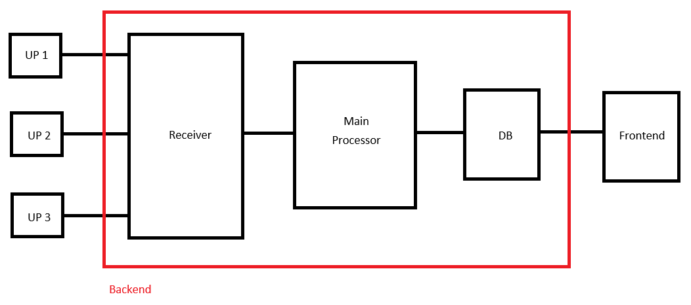

# 메이저 버전업의 이유
백엔드 기능이 복잡해짐에 따라 전적인 교통정리가 필요했고, 주로 버전업이 백엔드 버전을 기준으로 하고 있음. 앞으로 버전관리는 백엔드 버전, 프론트 버전, 데이터 버전, 제어채널 버전으로 나눠 관리할 것임. 현재 넘버링은 백엔드 버전이 상속받고, 나머지는 v1.0.0부터 시작.

# 백엔드 서버 v4.0.0

## 파이프라인 구조

수신부(Receiver)를 업스트림 성격별로 어떻게 다르게 처리할지는
[`v4_receiver_design.md`](./v4_receiver_design.md) 에 구체화함 — UP1 버퍼 큐 ·
UP2 비-큐화(파생 트리거) · UP3 우선순위 레인 · LLM 호출 동시성상한+rate limiter ·
DB 쓰기만 FIFO.

* 역할 설명
    
    <외부 업스트림>
    - UP1 : 푸시 알림 POST하는 외부 주체. v3에서 '업스트림'에 해당.
    - UP2 : Google Tasks/Scheduler에서 tick, wake를 보내는 주체.
    - UP3 : DM을 보내는 주체. ingest, edit 등과 같은 쓰기 작업이나 list, monitor와 같은 읽기 작업을 요청함. v3에서 '제어채널'에 해당.
    
    <백엔드>
    - Receiver : UP1, 2, 3에서 보내는 요청을 비동기적으로 수신하여 queue_receiver에 적재하는 역할. 큐는 폼이 완성된 순서대로 FIFO가 보장되어 햠.
    - Main Processor : 
        queue_receiver로부터 작업을 하나씩 꺼내서 쓰기/읽기 작업을 
    
    
    
    
    
    ingest, del, edit, list, monitor 등의 요청을 처리. queue_receiver에 가져온 요청들을 처리하여 반환된 값을 queue_main에 적재하여 FIFO로 DB에 write, read 등 시도. queue_main을 두는 이유는 간혹 생길 수 있는 DB에 대한 requests burst를 방지하기 위함. 만약 한 요청에 대하여 5번 재시도 가능(10초 슬립)하며, 그럼에도 불구하고 거절되면 에러로그와 함께 이 요청은 pending_requests.json에 저장하고 다음 요청으로 이동. pending_requests.json에 저장된 요청들은 추후 수동 `/ingest --keep`시 이 파일을 전달 또는 감지해서 ingest 처리.

        - 
        - write 계열 : ingest, edit, del, tick 및 wake(변동 발생 시) queue_main에 담아 순차적으로 DB에 /write 실행. 폴백으로 10초 슬립 후 5번 재시도. 그럼에도 안되면 queue_keep.json 등으로 저장해놨다가 수동 `/ingest --keep`시 이 파일을 전달 또는 감지하면 자동으로 write 처리.
        - read 계열 : list, monitor 등 DB에게 fetch 등을 통해 내용확인만 하여 전달하는 작업. 마찬가지 queue_main에 담아 순차적으로 실행.

* 메인 컨텐츠 : preview, notice, tweet
    

## preview
- 개요 : 멤버들의 방송 예고 관리
- 소스 트리거 : 업스트림 POST, 제어채널 POST, GC tasks
