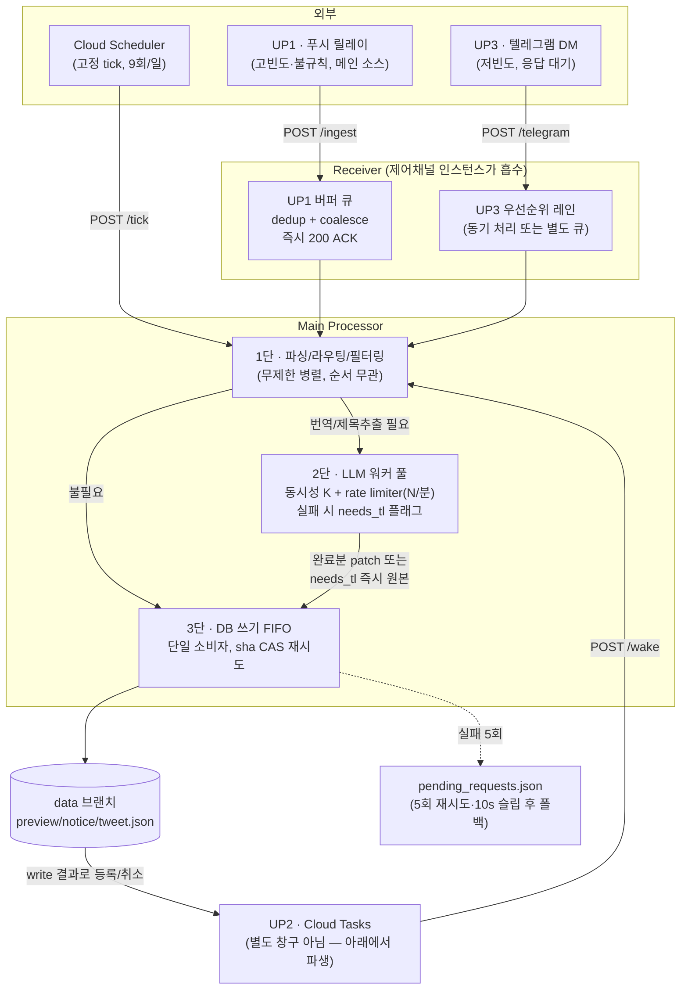

# v4 수신부(Receiver) 설계 — 업스트림별 처리 전략

`v4_improvi_plan.md`의 파이프라인 구조(Receiver → queue_receiver → Main Processor →
queue_main → DB)를 업스트림 3종의 실제 성격에 맞게 구체화한 문서. 근거 자료는
`v4_rw_classification.md`(v3 read/write 분류표)와 대화 세션에서 정리한 업스트림별
부하 특성.

## 상태: 설계 검토 중 (구현 착수 전)

---

## 1. 세 업스트림의 성격

| | 성격 | 부하 패턴 | 특징 |
|---|---|---|---|
| **UP1** (푸시 릴레이 — 폰 Automate) | 메인 이벤트 소스 | 고빈도·불규칙, 버스트 심함 (실측 `tweet` 컬럼 하루 0~57건, 4~5배 변동폭) | 시스템의 실질적인 트리거. 다른 두 업스트림보다 우선 처리 대상 |
| **UP2** (Cloud Scheduler/Tasks — tick·wake) | UP1(·UP3)이 등록한 것에 대한 파생 동작 | 고정분(스케줄러 9회/일) + 등록된 방송 수에 선형 비례 | **독립 입력이 아님** — 등록 0건이면 완전히 논다(scale-to-zero와 자연히 맞음) |
| **UP3** (텔레그램 DM — 제어채널) | 운영자가 필요할 때 쓰는 상호작용형 | 저빈도, 그러나 응답을 그 자리에서 기다림 (`pending_op` TTL 60~180s) | 볼륨은 셋 중 최소, 그러나 **지연에 가장 민감** |

## 2. 설계 원칙

세션에서 검증된 3가지 원칙을 그대로 구현 규칙으로 못 박는다.

1. **FIFO(엄격한 순서 보장)는 "순서가 결과를 바꾸는 곳"에만 둔다.**
   `data` 브랜치 쓰기가 여기 해당 — 파일이 sha 기반 optimistic concurrency로 보호되는
   단일 공유 자원이고, `merge_*` 로직(최신 Snowflake가 이김 등)이 도착 순서에 의존하기
   때문. 그 외 구간에 FIFO를 두면 head-of-line blocking만 유발한다.

2. **UP2는 Receiver의 수신 창구가 아니라 Main Processor의 산출물(side effect)이다.**
   "등록된 게 없으면 논다"는 특징 자체가 이미 Cloud Tasks의 event-driven 모델과
   일치한다. UP1/UP3 write 처리 결과로 Cloud Tasks를 등록·취소하는 로직으로 흡수하고,
   별도 큐/워커를 두지 않는다.

3. **외부 API(LLM) 앞에는 FIFO가 아니라 "동시성 상한 + rate limiter"를 둔다.**
   rate limit 위반 방지가 목적이면 필요한 건 처리량 제한이지 순서 보장이 아니다.
   Groq 등 실제 제한이 RPM/TPM 같은 처리량형이므로, 동시성 K + 시간당 처리량 N인
   워커 풀로 대응한다. LLM 호출은 항목별로 독립적이라 순서를 지킬 이유가 없다.
   버스트(UP1 특징) 때 여러 항목이 한꺼번에 LLM 큐에 꽂히는 순간에도, rate limiter가
   자연스럽게 다음 윈도우로 밀어주므로 429 동시 다발 → 백오프 중첩을 막는다.

4. **쓰기는 LLM 완료를 기다리지 않는다.** v3의 `needs_tl` 패턴(실패/지연 시 플래그만
   남기고 원본 데이터는 즉시 커밋, 번역은 나중에 별도 패치 커밋)을 v4에서도 유지한다.
   이게 없으면 원칙 3이 있어도 "LLM이 느리면 그 항목의 DB 반영 자체가 밀린다"는
   문제가 남는다.

## 3. 전체 구조

## 4. 컴포넌트 상세

### 4.1 UP1 경로 — 버퍼 큐

- `/ingest` 수신 즉시 200 ACK (폰 Automate는 fire-and-forget이라 응답을 오래 기다리게
  하면 안 됨).
- 큐 적재 시 기존 `tag`(`pde_noti_tag`) 기반 dedup 유지 + 같은 짧은 윈도우 내 중복
  트윗 coalesce.
- 이 큐는 **처리 지연이 있어도 무방** — 팬이 보는 화면 갱신 SLA가 분 단위(§SCHEDULE.md
  "커밋 → 화면 반영 최악 ~6분")라 버스트를 흡수하는 게 우선.

### 4.2 UP3 경로 — 우선순위 레인

- 볼륨이 가장 적고(하루 한 자릿수~십수 건) 사람이 기다리는 상호작용형이므로, UP1
  버퍼 큐와 **물리적으로 분리**한다. 구현 난이도상 가장 간단한 선택지는 큐를 아예
  안 쓰고 Receiver에서 동기 처리 — 버스트 흡수 이점이 필요 없는 트래픽이기 때문.
- `pending_op`(TTL 60~180s) 같은 세션 상태는 큐와 별개로 관리(admin_state 계열).

### 4.3 UP2 — 파생 트리거 (창구 아님)

- Receiver 앞단 3개 엔드포인트 목록에서 사실상 제외. `/tick`·`/wake`는 얇은 HTTP
  엔드포인트로만 유지하고, 실제 "다음에 언제 깨울지"는 Main Processor가 UP1/UP3
  write를 처리한 결과로 Cloud Tasks에 등록/취소한다.
- 등록 0건 → wake 0건 → 자동 idle이 구조적으로 보장되므로 별도 큐/워커/상시 리스너가
  불필요하다.

### 4.4 Main Processor 3단 파이프라인

| 단계 | 동시성 모델 | 이유 |
|---|---|---|
| 1. 파싱/라우팅/필터링 | 무제한 병렬 | CPU-bound, 항목 간 의존 없음 |
| 2. LLM 호출(notice 제목·개인 트윗 번역) | 동시성 K + rate limiter(N/분) | rate limit 회피 목적일 땐 순서 보장이 아니라 처리량 제한이 맞는 도구(§2 원칙 3) |
| 3. DB 쓰기 | FIFO, 단일 소비자 | 공유 파일 + optimistic concurrency + merge 순서 의존(§2 원칙 1) |

- 2단 실패(429 소진·타임아웃·환각가드)는 `needs_tl:true`만 남기고 3단으로 바로
  진행(원본 데이터 커밋은 LLM을 기다리지 않음) — 번역 결과는 도착 시 별도 작은 패치
  커밋으로 반영.
- 3단 쓰기 실패(sha 충돌 2회 초과, 또는 GitHub API 자체 장애)는 기존
  `v4_improvi_plan.md`의 정책대로 `pending_requests.json`에 저장 → 수동
  `/ingest --keep`으로 복구.

## 5. 기존 문서와의 관계

- `v4_improvi_plan.md` "파이프라인 구조" 절의 Receiver/Main Processor/queue_receiver/
  queue_main 서술을 이 문서가 구체화한다. 특히 queue_receiver를 **단일 FIFO 1개**로
  전제한 부분은 이 문서의 §2~§3 구조(UP1 버퍼 큐 + UP3 우선순위 레인 + UP2 비-큐화)로
  대체한다.
- `v4_rw_classification.md`의 write/read 분류표는 그대로 유효 — 이 문서는 그
  write/read 작업들이 "어떤 동시성 모델을 타는가"만 추가로 규정한다.

## 6. 남은 결정 사항

- [ ] LLM 워커 풀의 정확한 K(동시성 상한)·N(분당 처리량) 값 — Groq 실측 rate limit
      문서 대조 필요.
- [ ] UP3를 완전 동기 처리로 갈지, 아주 짧은(초 단위) 우선순위 큐를 둘지 — 제어채널
      인스턴스가 Main Processor 역할까지 흡수했을 때 동시 요청 처리 모델에 따라 결정.
- [ ] UP1 버퍼 큐의 coalesce 윈도우 길이(같은 트윗을 몇 초/분 안에 중복으로 볼지).
- [ ] `pending_requests.json` 재처리 시 UP1/UP3 우선순위를 그대로 유지할지, 별도
      저순위로 취급할지.
