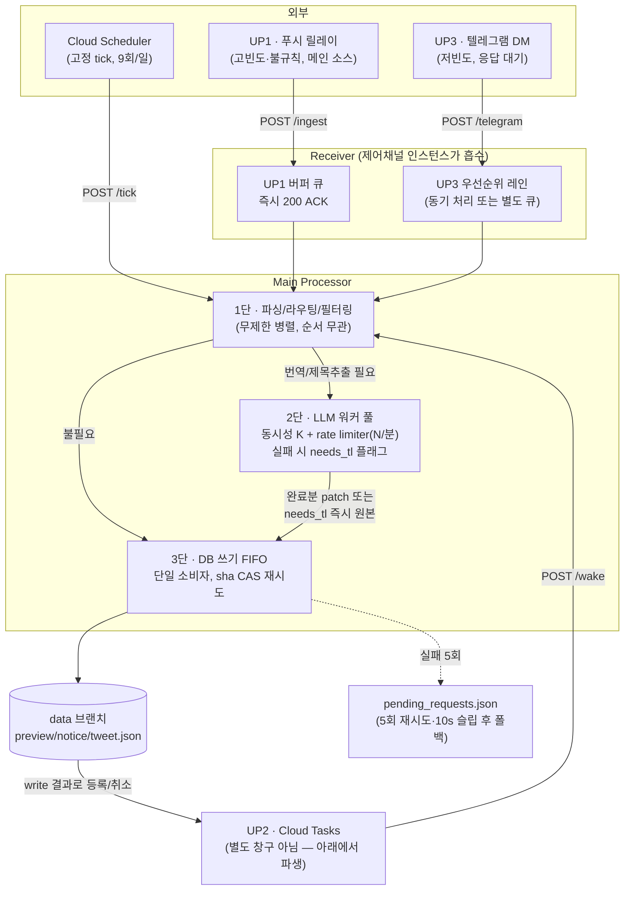

# v4 수신부(Receiver) 설계 — 업스트림별 처리 전략

`v4_improvi_plan.md`의 파이프라인 구조(Receiver → queue_receiver → Main Processor →
queue_main → DB)를 업스트림 3종의 실제 성격에 맞게 구체화한 문서. 근거 자료는
`v4_rw_classification.md`(v3 read/write 분류표)와 대화 세션에서 정리한 업스트림별
부하 특성.

## 상태: 설계 검토 중 (구현 착수 전)

---

## 1. 세 업스트림의 성격

| | 성격 | 부하 패턴 | 특징 |
|---|---|---|---|
| **UP1** (푸시 릴레이 — 폰 Automate) | 메인 이벤트 소스 | 고빈도·불규칙, 버스트 심함 (실측 `tweet` 컬럼 하루 0~57건, 4~5배 변동폭) | 시스템의 실질적인 트리거. 다른 두 업스트림보다 우선 처리 대상 |
| **UP2** (Cloud Scheduler/Tasks — tick·wake) | UP1(·UP3)이 등록한 것에 대한 파생 동작 | 고정분(스케줄러 9회/일) + 등록된 방송 수에 선형 비례 | **독립 입력이 아님** — 등록 0건이면 완전히 논다(scale-to-zero와 자연히 맞음) |
| **UP3** (텔레그램 DM — 제어채널) | 운영자가 필요할 때 쓰는 상호작용형 | 저빈도, 그러나 응답을 그 자리에서 기다림 (`pending_op` TTL 60~180s) | 볼륨은 셋 중 최소, 그러나 **지연에 가장 민감** |

## 2. 설계 원칙

세션에서 검증된 3가지 원칙을 그대로 구현 규칙으로 못 박는다.

1. **FIFO(엄격한 순서 보장)는 "순서가 결과를 바꾸는 곳"에만 둔다.**
   `data` 브랜치 쓰기가 여기 해당 — 파일이 sha 기반 optimistic concurrency로 보호되는
   단일 공유 자원이고, `merge_*` 로직(최신 Snowflake가 이김 등)이 도착 순서에 의존하기
   때문. 그 외 구간에 FIFO를 두면 head-of-line blocking만 유발한다.

2. **UP2는 Receiver의 수신 창구가 아니라 Main Processor의 산출물(side effect)이다.**
   "등록된 게 없으면 논다"는 특징 자체가 이미 Cloud Tasks의 event-driven 모델과
   일치한다. UP1/UP3 write 처리 결과로 Cloud Tasks를 등록·취소하는 로직으로 흡수하고,
   별도 큐/워커를 두지 않는다.

3. **외부 API(LLM) 앞에는 FIFO가 아니라 "동시성 상한 + rate limiter"를 둔다.**
   rate limit 위반 방지가 목적이면 필요한 건 처리량 제한이지 순서 보장이 아니다.
   Groq 등 실제 제한이 RPM/TPM 같은 처리량형이므로, 동시성 K + 시간당 처리량 N인
   워커 풀로 대응한다. LLM 호출은 항목별로 독립적이라 순서를 지킬 이유가 없다.
   버스트(UP1 특징) 때 여러 항목이 한꺼번에 LLM 큐에 꽂히는 순간에도, rate limiter가
   자연스럽게 다음 윈도우로 밀어주므로 429 동시 다발 → 백오프 중첩을 막는다.

4. **쓰기는 LLM 완료를 기다리지 않는다.** v3의 `needs_tl` 패턴(실패/지연 시 플래그만
   남기고 원본 데이터는 즉시 커밋, 번역은 나중에 별도 패치 커밋)을 v4에서도 유지한다.
   이게 없으면 원칙 3이 있어도 "LLM이 느리면 그 항목의 DB 반영 자체가 밀린다"는
   문제가 남는다.

## 3. 전체 구조

## 4. 컴포넌트 상세

### 4.1 UP1 경로 — 버퍼 큐

- `/ingest` 수신 즉시 200 ACK (폰 Automate는 fire-and-forget이라 응답을 오래 기다리게
  하면 안 됨).
- 수신부에서 dedup·coalesce는 하지 않는다(§6.3). 중복 방어는 v3처럼 DB 병합 단계의 id 멱등성
  (`xtweet.merge_thread`·`notices.merge_notice`의 `dup` no-op)이 그대로 맡는다.
- 이 큐는 **처리 지연이 있어도 무방** — 팬이 보는 화면 갱신 SLA가 분 단위(§SCHEDULE.md
  "커밋 → 화면 반영 최악 ~6분")라 버스트를 흡수하는 게 우선.

### 4.2 UP3 경로 — 우선순위 레인

- 볼륨이 가장 적고(하루 한 자릿수~십수 건) 사람이 기다리는 상호작용형이므로, UP1
  버퍼 큐와 **물리적으로 분리**한다. 구현 난이도상 가장 간단한 선택지는 큐를 아예
  안 쓰고 Receiver에서 동기 처리 — 버스트 흡수 이점이 필요 없는 트래픽이기 때문.
- `pending_op`(TTL 60~180s) 같은 세션 상태는 큐와 별개로 관리(admin_state 계열).

### 4.3 UP2 — 파생 트리거 (창구 아님)

- Receiver 앞단 3개 엔드포인트 목록에서 사실상 제외. `/tick`·`/wake`는 얇은 HTTP
  엔드포인트로만 유지하고, 실제 "다음에 언제 깨울지"는 Main Processor가 UP1/UP3
  write를 처리한 결과로 Cloud Tasks에 등록/취소한다.
- 등록 0건 → wake 0건 → 자동 idle이 구조적으로 보장되므로 별도 큐/워커/상시 리스너가
  불필요하다.

### 4.4 Main Processor 3단 파이프라인

| 단계 | 동시성 모델 | 이유 |
|---|---|---|
| 1. 파싱/라우팅/필터링 | 무제한 병렬 | CPU-bound, 항목 간 의존 없음 |
| 2. LLM 호출(notice 제목·개인 트윗 번역) | 동시성 K + rate limiter(N/분) | rate limit 회피 목적일 땐 순서 보장이 아니라 처리량 제한이 맞는 도구(§2 원칙 3) |
| 3. DB 쓰기 | FIFO, 단일 소비자 | 공유 파일 + optimistic concurrency + merge 순서 의존(§2 원칙 1) |

- 2단 실패(429 소진·타임아웃·환각가드)는 `needs_tl:true`만 남기고 3단으로 바로
  진행(원본 데이터 커밋은 LLM을 기다리지 않음) — 번역 결과는 도착 시 별도 작은 패치
  커밋으로 반영.
- 3단 쓰기 실패(sha 충돌 2회 초과, 또는 GitHub API 자체 장애)는 기존
  `v4_improvi_plan.md`의 정책대로 `pending_requests.json`에 저장 → 수동
  `/ingest --keep`으로 복구.

## 5. 기존 문서와의 관계

- `v4_improvi_plan.md` "파이프라인 구조" 절의 Receiver/Main Processor/queue_receiver/
  queue_main 서술을 이 문서가 구체화한다. 특히 queue_receiver를 **단일 FIFO 1개**로
  전제한 부분은 이 문서의 §2~§3 구조(UP1 버퍼 큐 + UP3 우선순위 레인 + UP2 비-큐화)로
  대체한다.
- `v4_rw_classification.md`의 write/read 분류표는 그대로 유효 — 이 문서는 그
  write/read 작업들이 "어떤 동시성 모델을 타는가"만 추가로 규정한다.

## 6. 결정 사항

### 6.1 LLM 워커 풀 K·N — 결정 (Groq 문서 대조 완료, 토큰 실측만 남음)

근거: Groq rate-limits 문서(무료 플랜, `openai/gpt-oss-120b`·`gpt-oss-20b` 동일 행) —
**RPM 30 / RPD 1,000 / TPM 8,000 / TPD 200,000**, 조직 단위, 먼저 닿는 한도가 적용됨.
프로젝트가 무료 티어인 것은 `docs/VERSION.md` v3.2.0 서술로 확인. 응답 헤더로
`retry-after`(429일 때만)·`x-ratelimit-remaining-tokens`·`x-ratelimit-reset-tokens`가 옴.

- **병목은 RPM(30)이 아니라 TPM(8,000)·TPD(200K)다.** 호출 1건이 토큰을 많이 쓰므로
  요청 수 기준 limiter는 무의미하고, **토큰 기준 limiter**로 둔다.
- **N = TPM 8,000 토큰 버킷.** 호출 직전에 `입력 추정 + max_tokens`를 예약하고, 응답의
  `x-ratelimit-remaining-tokens`로 보정한다. 429 시 고정 1/2/4초가 아니라 `retry-after`를 따른다.
- **K = 2.** TPM 상한이 허용하는 처리 속도가 느려 K=1로도 상한을 채우지만, `LLMClient.timeout=20s`
  짜리 호출 하나가 뒤 항목을 막지 않게 하는 최소값이다. K를 키워도 처리량은 늘지 않는다(N이 결정).
- **limiter는 HTTP 호출 단위로 재시도 루프 "안쪽"에 둔다.** 현행 코드는 `participation`이
  최대 5회 × (메인+폴백) 호출, `_call_groq`가 호출당 3회 백오프라 429 국면에서 호출 수가
  배로 늘어난다 — 항목 단위로 limiter를 걸면 이 증폭을 못 막는다.
- **미확인(구현 전 확인 필요):** ① 호출 1건의 실제 `usage.total_tokens`(현재 로그는 프롬프트
  글자 수 `in=`만 남김 → 로그에 `usage` 추가 필요). ② 120b와 20b 버킷이 독립인지(문서 표는
  모델별 행이나 공유 여부 미명시 — 폴백을 여유 용량으로 계산하지 말 것). ③ `max_tokens`가 TPM에
  선차감되는지(문서 미명시 — 보수적으로 예약 방식 채택).

### 6.2 UP3 처리 — 결정: 전용 레인 + 단일 워커 (동기 처리 안 함)

요구: 유지보수가 쉽고, Main Processor가 동작 중이어도 요청을 받을 수 있을 것.

- Receiver(HTTP 스레드)는 `/telegram`을 **받는 즉시 UP3 전용 in-memory 레인에 넣고 반환**한다.
  Main Processor·UP1 버퍼 큐의 상태와 무관하게 수신은 항상 가능하다.
- UP3 레인의 소비자는 **단일 워커 1개**. 이유: `pending_op` 마법사는 다단계 대화이고 상태가
  `admin_state.json` 한 슬롯이라(read-modify-write) 같은 운영자의 연속 메시지가 병렬로 돌면
  안 된다. 워커 1개면 대화 순서가 구조적으로 보장돼 별도 락이 필요 없다.
- **파싱/라우팅 코드는 UP1과 공유**(같은 Main Processor 함수를 호출)하고 레인·워커만 분리한다.
  UP3만의 별도 처리 경로를 만들지 않는 것이 유지보수 기준이다.
- read 계열(list/monitor)은 DB FIFO를 거치지 않고 UP3 워커가 직접 읽어 응답한다.
- write 계열은 §2 원칙 1대로 **DB FIFO에 합류**(우선순위 삽입 없음). 운영자가 방금 본 상태 위에
  편집한 것이 UP1 쓰기보다 앞서 적용돼 순서가 뒤집히는 것을 막기 위함.
- 참고: v3 현행도 같은 모양이다(제어채널 동시 80 + `/write` `concurrency=1`,
  `docs/INGEST_FLOW.md` "어디서 실행되나").

### 6.3 UP1 dedup·coalesce — 결정: 도입하지 않음 (과설계)

수신부에 중복 제거·coalesce 윈도우를 두려던 원안은 폐기한다. 데이터 근거
(`mewtype-scheduler-data` `monitoring/events-*.jsonl`, 2026-09-09 ~ 09-19, 11일·1,596건):

- **notice: `dup` 0건.** notice는 모든 mode가 기록되는 경로(`log_event(... "mode: {mode}")`)라 신뢰할 수
  있다. 실시간 notice 28건 중 mode는 added/updated/skip뿐이고, `skip` 1건(09-19 01:27Z)은 중복이 아니라
  "이미 지난 날짜의 새 소식은 예고판에 안 올림"(`notices.merge_notice` 4번 분기)이다.
- **tweet: 기록상 `dup` 0건이나 증거로 못 쓴다.** `_commit_personal_tweet`이 `changed=False`(dup·stale)면
  `log_event` 앞에서 조기 반환하고 DM도 안 보내서, 트윗 중복은 로그에 남지 않는다. 대신 중복이 와도
  `merge_thread`가 id 일치로 no-op 처리하므로 DB에는 영향이 없다.
- 결론: 관측된 중복 피해가 없고, 발생해도 DB 병합의 멱등성이 이미 막는다. 수신부 dedup은 (LLM 호출을
  아끼는 정도의) 이득 대비 상태·경합 복잡도만 늘린다.

### 6.4 `pending_requests.json` — 결정: 자동 재처리 없음, UP3 수동 재투입

`pending_requests.json`은 운영자가 **모니터로 대기 건수를 확인**하고, 있으면 **UP3(`/ingest --keep`)로
ingest 처리**하는 용도다. 따라서 "UP1/UP3 우선순위를 유지할지" 질문은 성립하지 않는다.

- 재처리는 **운영자가 UP3로 트리거**하므로 UP3 레인을 타고 일반 write와 같이 DB FIFO에 합류한다.
  UP1과 자동으로 경쟁하는 별도 재시도 루프를 만들지 않는다.
- 대기 건수 집계·monitor 표시는 만들지 않는다(§6.5). pending 파일이 DM으로 도착하는 것 자체가 알림이다.
- **제안:** 파일에는 원문이 아니라 **LLM 단계까지 끝난 커밋 페이로드**를 저장해 재투입 시 LLM
  예산(§6.1의 TPM/TPD)을 다시 쓰지 않게 한다. 실패 원인이 DB(GitHub)라 LLM 결과는 이미 유효하다.

### 6.5 새로 발견된 미결

- [x] `pending_requests.json`의 **저장 위치 — 결정: 운영자 DM으로 파일 전송.** 쓰기 재시도 5회가
      모두 실패하면 해당 요청을 `pending_requests.json`으로 만들어 텔레그램 DM에 첨부 발송한다.
      배경: 이 파일은 GitHub 쓰기 실패 시의 폴백인데, Cloud Run scale-to-zero면 로컬 디스크는
      휘발성이고 `data` 브랜치에 쓰면 실패 원인(GitHub 장애)과 겹친다. 텔레그램은 GitHub와 장애
      원인이 독립이고 별도 인프라가 필요 없다. v3에 발송(`notify.send_document`)과 수신
      (`message["document"]` 처리, `/ingest`의 "원문/파일" 슬롯)이 이미 있어 `/ingest --keep`에
      파일을 첨부(전달)하는 원안 흐름과 그대로 맞는다.
- [x] **monitor의 "대기 건수" — 결정: 만들지 않음 (과설계).** DM으로 보관하면 봇이 DM 이력을 읽을 수
      없어 건수를 셀 출처가 없고, 이를 위해 이벤트 로그에 별도 이벤트를 심는 것은 과하다. pending 파일이
      DM으로 도착하는 것이 곧 알림이며, 운영자는 DM에서 파일을 보고 `/ingest --keep`으로 첨부해 재투입한다.
- [x] DM 발송 자체가 실패하는 경우(텔레그램 장애) — 결정: **유실 처리.** 더 물러설 곳이 없는
      최후 단계이므로 에러 로그만 남기고 해당 요청은 폐기한다(추가 폴백·재시도 계층을 두지 않는다).
- [ ] §6.1 미확인 3건(토큰 실측·버킷 독립성·`max_tokens` 선차감) 검증.
